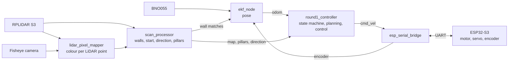

# MäcLEGO — WRO Future Engineers 2026

Team MäcLEGO, Rabanus-Maurus-Schule Fulda, Germany.

This repository holds everything behind our self-driving vehicle for the WRO
Future Engineers category: the code for both controllers, the electronics, the
engineering journal, and the setup that turns a fresh Jetson into the vehicle.

The vehicle drives both challenges fully autonomously. A **Jetson Orin Nano**
localises the car on a map of the field with an extended Kalman filter, fed by a
360° LiDAR, a gyroscope and the wheel encoder, and it gives every LiDAR point a
colour from a fisheye camera — so each pillar is measured with its distance and
its colour at the same time. An **ESP32-S3** on our own main PCB drives the
motor and the steering servo with hard timing. Both sit in one stack: the PCB
plugs directly onto the Jetson.

## At a glance

| | |
|---|---|
| Compute | NVIDIA Jetson Orin Nano (ROS 2 Humble, Python) + ESP32-S3 (C++, PlatformIO) |
| Main PCB | own 4-layer board, V5: power path, motor driver, servo interface, LiDAR USB bridge |
| Sensors | Slamtec RPLIDAR S3 at 15 Hz · PiCam360 fisheye · Bosch BNO055 · Hall wheel encoder |
| Actuators | 12 V gear motor on a VNH5019 H-bridge · Waveshare SC09 serial steering servo |
| Power | 4S LiPo, 450 mAh for races, 1150 mAh for testing; two inputs, hot-swappable |
| Localisation | EKF on gyro, encoder and walls matched to the field map |
| Obstacles | colour per LiDAR point, pillars voted onto the 24 seats of the field |

## Vehicle, team and videos

<!-- PLACEHOLDER: fill in the video links here and in video/video.md, then
remove this comment. -->

| Front | Left |
|---|---|
|  |  |

All six sides are in [`v-photos/`](v-photos).


Clemens (mechanical design), Jannik (electronics and main PCB) and Finn
(software). More in [`t-photos/`](t-photos).

## Engineering journal

The journal is written in Markdown in [`docs/journal/`](docs/journal) — one
chapter per rubric criterion, readable directly on GitHub. The same files are
built into a PDF on every push (GitHub Actions → *Engineering journal*) and
attached to every release.

| Rubric criterion | Chapter |
|---|---|
| — | [0 Overview](docs/journal/01-overview.md) |
| 1 Mobility and mechanical design | [1 Mobility and mechanical design](docs/journal/02-mobility.md) |
| 2 Power and sensor architecture | [2 Power and sensor architecture](docs/journal/03-power-sensors.md) |
| 3 Software architecture and obstacle strategy | [3 Software architecture and obstacle strategy](docs/journal/04-software.md) |
| 4 Systems thinking and engineering decisions | [4 Systems thinking and engineering decisions](docs/journal/05-systems.md) |
| 5 Reproducibility and GitHub quality | [5 Reproducibility](docs/journal/06-reproducibility.md) |

Every number in the journal has a source: a figure generated by the scripts in
[`docs/analysis/`](docs/analysis), a data file in [`docs/data/`](docs/data), a
recorded run, or a commit.

## How the code relates to the vehicle

Each electromechanical component, how it is connected, and which code talks to
it:

| Component | Connected to | Code |
|---|---|---|
| RPLIDAR S3 | UART → CP2102N USB bridge on the main PCB → Jetson USB | [`src/sllidar_ros2`](src/sllidar_ros2) publishes `/scan` |
| PiCam360 fisheye camera | Jetson USB | [`src/ros_deep_learning`](src/ros_deep_learning) `video_source` |
| BNO055 IMU | I²C, passed through the main PCB to the Jetson's 40-pin header | [`src/bno055`](src/bno055) publishes `/bno055/imu` |
| Drive motor + Hall encoder | VNH5019 H-bridge and encoder inputs of the ESP32-S3 | [`src/esp_firmware`](src/esp_firmware) motor task |
| SC09 steering servo | half-duplex serial bus of the ESP32-S3 | [`src/esp_firmware`](src/esp_firmware) |
| Start button, status LED | ESP32-S3 GPIO | [`src/esp_firmware`](src/esp_firmware) |
| Battery voltage, motor current | ESP32-S3 ADC | [`src/esp_firmware`](src/esp_firmware), reported to the Jetson |
| ESP32-S3 ↔ Jetson | UART on the 40-pin header, binary protocol | [`src/esp_bridge`](src/esp_bridge) ↔ firmware, see [`JETSON_BRIDGE.md`](src/esp_firmware/docs/JETSON_BRIDGE.md) |

The software on the Jetson is a set of ROS 2 nodes:



| Package | What it does |
|---|---|
| [`ekf`](src/ekf) | scan processing, EKF localisation, the race controller with its state machine, parking and unparking |
| [`camera_lidar_fusion`](src/camera_lidar_fusion) | projects every LiDAR point into the fisheye image and classifies its colour; camera calibration tools |
| [`esp_bridge`](src/esp_bridge) | serial link to the ESP32: speed controller, steering table, clock synchronisation |
| [`robot_msgs`](src/robot_msgs) | message definitions |
| [`esp_firmware`](src/esp_firmware) | ESP32-S3 firmware: motor control every 10 ms on one core, commands, servo and battery on the other |

Two controllers, one rule: everything that needs the map or the camera runs on
the Jetson; everything that has to react to the motor within milliseconds runs
on the ESP32, which also stops the motor by itself if the Jetson falls silent.
The details are in [chapter 3](docs/journal/04-software.md).

## Repository structure

| Folder | Content |
|---|---|
| [`src/`](src) | all code: ROS 2 packages, ESP32 firmware, start script |
| [`schemes/`](schemes) | main PCB: KiCad project, schematic PDF, BOM and placement files |
| [`models/`](models) | CAD as STEP: full assembly and chassis |
| [`src/Hardware/`](src/Hardware) | chassis CAD: Fusion 360 source and STL |
| [`config/`](config) | calibration files the nodes load at run time |
| [`setup/`](setup) | what the Jetson needs beyond this repository: environment, device rules, autostart |
| [`docs/`](docs) | engineering journal, analysis scripts, measurement data, figures |
| [`v-photos/`](v-photos) | vehicle photos from every side |
| [`t-photos/`](t-photos) | team photos |
| [`video/`](video) | links to the driving videos |

## Build, flash and run

[`setup/README.md`](setup/README.md) takes a fresh Jetson Orin Nano to the
running vehicle. In short:

```bash
# Git LFS first: src/ contains CAD files stored with LFS
sudo apt install git-lfs && git lfs install
git clone --recurse-submodules https://github.com/Mac-Lego-RMS/MaecLEGO-WRO-FE-2026 ~/ros2_ws
cd ~/ros2_ws

sudo cp setup/udev/*.rules /etc/udev/rules.d/ && sudo udevadm trigger
docker build -t my_robot_base_yolo2 setup/      # ROS 2 Humble + jetson-inference

# inside the container, in /workspace:
cp src/ros_deep_learning/package.ros2.xml src/ros_deep_learning/package.xml
colcon build --symlink-install
```

The ESP32-S3 firmware is a PlatformIO project; it is flashed over the USB-C port
of the main PCB:

```bash
cd src/esp_firmware
pio run -t upload
```

At power-on the systemd unit [`setup/systemd/robot.service`](setup/systemd/robot.service)
runs [`src/start_robot.sh`](src/start_robot.sh), which starts the container and
every node in its own `tmux` window. The run starts with the start button on the
vehicle. The challenge (`RACE_MODE=open` or `obstacle`) and whether the vehicle
starts in the parking bay (`UNPARK`) are set at the top of the start script.

Three packages come from upstream projects: `ros_deep_learning` is a pinned
submodule; `sllidar_ros2` and `bno055` are included because the vehicle relies
on small changes to them (LiDAR at 15 Hz, IMU publishing only what is used).

## Testing

Unit tests run without hardware and without ROS:

```bash
cd src/camera_lidar_fusion && python3 -m pytest test -q    # fisheye model, colours, blind sectors
cd src/ekf/ekf && python3 test_unpark.py                   # and the other test_*.py
pip install -r docs/analysis/requirements.txt
cd docs/analysis && python3 -m pytest -q tests             # analysis toolkit on synthetic bags
```

On the vehicle, every run is recorded as a rosbag and evaluated with the scripts
in [`docs/analysis/`](docs/analysis); bench measurements use the reproducible
speed sweep `ros2 run esp_bridge pwm_sweep`. The workflow is described in
[chapter 5](docs/journal/06-reproducibility.md).

## Versions

| Version | State |
|---|---|
| [v1.0](https://github.com/Mac-Lego-RMS/MaecLEGO-WRO-FE-2026/releases/tag/v1.0) | German national final, June 2026 |
| v2.0 | international final — the current `main` |

## On the Jetson

On the vehicle the repository lives in `~/ros2_ws` with a sparse checkout of
`src/`, so `git pull` there fetches the software only; photos, models and
documentation stay off the vehicle.

## Use of AI tools

We used AI assistants (Claude, by Anthropic) while preparing this repository.
They helped us collect material from our code, schematics, measurements and
notes into a structured journal, draft and translate text, write the scripts
that turn our recordings into figures and the bench-test tool, and check the
documentation against the code. That made our work faster and better organised.

The vehicle itself is our own work: the mechanical design, the electronics and
the PCB, the software architecture and its algorithms, every measurement and
every engineering decision. We reviewed what is written here and can explain it.
