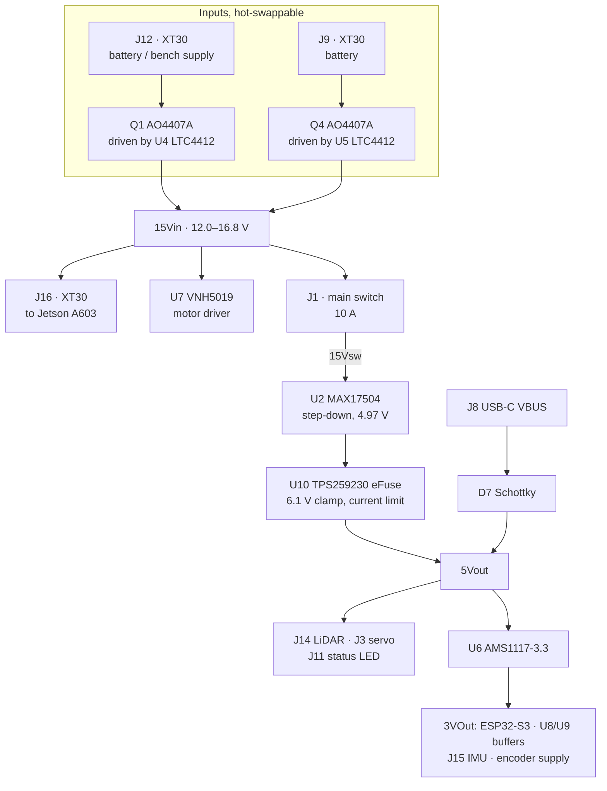
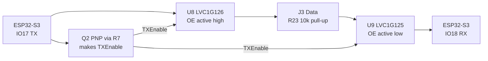
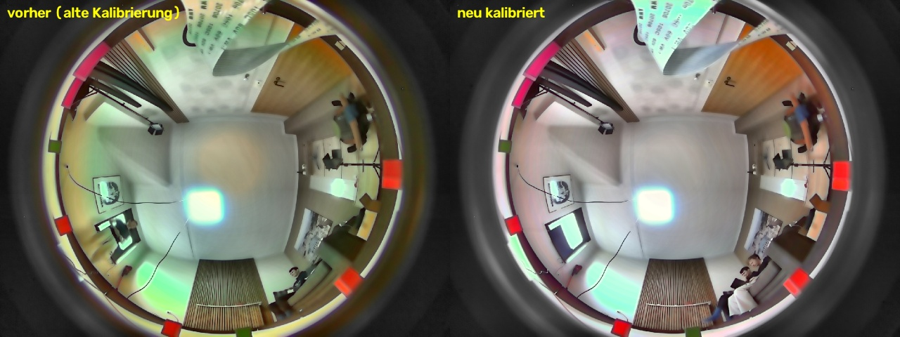
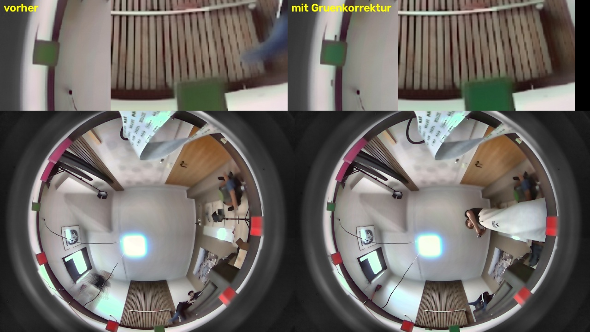

# Power and sensor architecture

**Evidence at a glance.** Where this chapter answers each point of the
rubric for criterion 2:

| The rubric asks for | Section | Key evidence |
| --- | --- | --- |
| Power architecture, planned distribution | [Dual-input power path](#dual-input-power-path), [Regulation](#regulation) | two hot-swappable inputs, two regulated rails, Jetson deliberately unswitched |
| Power budget, current draw | [Power budget](#power-budget) | 1.10–1.30 A measured per state; Jetson 76 %; consistent with the recorded discharge curve |
| Wiring diagram | [Wiring](#wiring) | vehicle-level wiring, schematic, all four copper layers, pin map |
| Sensor selection and trade-offs | [Sensor set](#sensor-set), [LiDAR: selection](#lidar-selection) | three LiDARs compared; YOLO replaced for latency; why no ultrasonic or line sensor |
| Placement justified with the field geometry | [LiDAR: placement](#lidar-placement), [Camera](#camera) | 55 mm scan plane against 100 mm walls, ±0.9° tilt tolerance; scan plane in the camera's view from 0.18 m |
| Noise, interference, shadows | [Interference](#interference-measured-and-it-is-mechanical), [Camera](#camera) | PWM on and off give identical IMU noise; yaw unaffected; exposure measured on the field |
| Calibration methods | [Calibration](#calibration) | cross-checked analogue channels; camera–LiDAR zone measured with a pillar at 5–6 distances; lens 197° measured, not 270° from the data sheet |
| Failure points | [Protection](#protection), [Failure points and mitigation](#failure-points-and-mitigation) | 6.1 V clamp in front of the 650 € LiDAR; failure-mode table |
| Iteration to improve reliability | [Design evolution](#design-evolution), [Iteration](#iteration-locating-and-removing-the-vibration-source) | five board revisions; three drive-gear mountings measured, yaw noise −23 to −73 %; three faults found by measurement |

All electronics of the vehicle sit on a single custom 4-layer PCB that mounts
directly on top of the Jetson Orin Nano carrier board (Seeed A603) as a **stack**:
one 40-pin header carries the mechanical and electrical connection, two M3 screws
prevent the board from tilting off the header. The board is 86.5 × 52 mm.

The stack is the reason for several of the decisions below. It forces the
component height down, it removes every cable that a separate controller board
would need, and it lets the whole vehicle run with a **single USB cable** inside
the chassis.

The board carries four jobs:

1. **Power distribution** — two battery inputs, hot-swap switchover, two
   regulated rails, protection.
2. **Real-time actuation** — an on-board ESP32-S3 with a full H-bridge motor
   driver and a half-duplex serial servo interface.
3. **Sensor interfacing** — LiDAR via an on-board USB-UART bridge, IMU passed
   through to the Jetson's I²C bus.
4. **Telemetry** — battery voltage and motor current measurement fed back to the
   Jetson.

## Power supply and power budget

### Energy source

| | Race pack | Endurance pack |
| --- | --- | --- |
| Type | Ovonic 4S LiPo | Ovonic 4S LiPo |
| Capacity | 450 mAh | 1150 mAh |
| Discharge rating | 60 C (≈27 A) | 60 C (≈69 A) |
| Stored energy | 6.7 Wh | 17.0 Wh |
| Time to the 3.8 V/cell warning, measured | **10.0 min** | **26.0 min** |

The system draws **1.10 A standing and 1.30 A at full speed, 16–19 W**, measured
state by state in [Power budget](#power-budget).

The smaller pack is used for competition runs, where its lower mass matters and
its 10 minutes to the warning cover a 3-minute round with a large reserve. The
larger pack is used for development and testing, where runtime dominates.

The 60 C rating is not required by the average current — it is required so that
the pack voltage does not sag during motor acceleration, which would otherwise
propagate into the 5 V rail and into the low-voltage warning.

#### Discharge curve

With the battery monitoring repaired (see below), both packs were recorded from
full charge with the vehicle standing, all nodes running and the LiDAR turning,
motor off — the *full system idle* state of the power budget, 1.10 A.

Data: bags `Entladung_450` and `Entladung_1150` via
[`battery_curve.py`](../analysis/battery_curve.py) into
[`data/discharge.csv`](../data/discharge.csv). Both discharges were ended by hand
at about 3.7 V per cell: under load we do not take a LiPo lower than that. After
the race pack, a cable tore off while switching over to the bench supply and the
Jetson lost power before the recorder had closed the bag, so that bag was
recovered with `sqlite3 .recover`. Readings of 17.4 V at the start and end, more
than a 4S pack can deliver, are the bench supply on the second input; they are
dropped.

| | Race pack, 450 mAh | Endurance pack, 1150 mAh |
| --- | ---: | ---: |
| Start | 16.53 V (4.13 V/cell) | 16.89 V (4.22 V/cell) |
| After 3 min, one round | 16.00 V (4.00 V/cell) | 16.64 V (4.16 V/cell) |
| **Warning, 15.2 V (3.8 V/cell)** | **after 10.0 min** | **after 26.0 min** |
| End of recording | 14.90 V after 14.5 min | 14.82 V after 39.9 min |

A round takes 3 minutes and leaves the race pack at 4.0 V per cell, far above the
warning. A freshly charged race pack therefore covers a round with a large
reserve.

**The two curves check each other.** The time to the warning scales with the
capacity: 26.0 / 10.0 = 2.60 against 1150 / 450 = 2.56, within 2 %. The race pack
also starts 0.36 V lower at the same current. That is expected: 1.10 A is a
2.4 C load for the small pack but only about 1 C for the large one, so its
voltage sags further.

#### Battery monitoring

There is no separate BMS or hardware cutoff. The pack voltage is divided by
R6/R8 (100 kΩ / 22 kΩ, filtered by C11 = 100 nF) into GPIO **IO1** of the ESP32-S3:

$$
V_\mathrm{ADC} = V_\mathrm{BAT}\cdot\frac{22}{100+22} = 0.180\,V_\mathrm{BAT}
$$

At a full pack (16.8 V) this yields 3.03 V, just inside the ESP32-S3 ADC range —
the divider is dimensioned specifically for a 4S pack and uses the available range
almost completely.

The firmware raises a warning at **3.8 V per cell (15.2 V pack)** and forwards it
over the UART link to the Jetson, which reacts to it and republishes it as a ROS 2
topic visible in Foxglove. The decision to keep the cutoff in software rather than
in hardware is deliberate: an autonomous vehicle must not lose its compute in the
middle of a scored run, so the reaction is a controlled one rather than a
disconnection.

#### Fault found and fixed: the divider read 18 % high

Cross-checking the reported pack voltage against the bench supply showed **17.52 V
reported at 14.8 V actual** — a factor of 1.184. The consequence is that the
low-voltage warning does not fire where it is supposed to:

| | Reported | Actual |
| --- | ---: | ---: |
| Warning threshold, 3.8 V/cell | 15.2 V | **12.84 V = 3.21 V/cell** |
| Full pack | 19.9 V | 16.8 V |

A warning at 3.21 V/cell is deep-discharge territory. The protection was
ineffective and would have come too late to react to during a scored run.

Cause: a failed resistor in the R6/R8 divider. 17.52 V reported corresponds to
3.159 V at the pin, which is essentially the ESP32-S3 ADC's full scale, so the
reading is at or near saturation. A secondary symptom confirms it — the state of
charge published to Foxglove is computed as `(cell_v - 3.3) / (4.2 - 3.3)`, which
at a reported 4.38 V/cell clamps to 100 % permanently.

The GPIO itself is not at risk. With the lower resistor open, the pin sees the pack
voltage through R6 = 100 kΩ, and the ESP32's clamp diodes limit the current to
(14.8 − 3.3) / 100 kΩ = **115 µA**, two orders of magnitude below what those diodes
tolerate.

**Fix:** the failed resistor was replaced. After the repair the bridge reports
15.56 V and a state of charge of 65 % — the percentage is no longer pinned at 100 %,
so the divider is back in its linear range. Against a multimeter it is now
accurate to ±1.1 % (see [Calibration](#battery-voltage)).

The fault is documented here rather than silently repaired because of how it was
found: not by the warning misbehaving, but by cross-checking one measurement
against an independent reference during an unrelated test. In hindsight it is visible in every recording: all 73 recorded runs from
11 to 29 September report exactly 17.52 V as their minimum pack voltage
([chapter 5](06-reproducibility.md#evaluation-in-foxglove)).

### Dual-input power path

Two XT30 inputs are combined by a pair of **LTC4412 ideal-diode controllers**
driving P-channel MOSFETs (AO4407A). The higher-voltage source takes over
automatically, with no diode drop and no reverse current into the lower source.

**Why this instead of a simple Schottky OR:** a Schottky diode would drop
0.3–0.5 V continuously at ~1.3 A, dissipating around half a watt per branch and
costing runtime. The LTC4412 does the same job with a MOSFET's 28 mΩ-class
on-resistance. It also removes the need for external comparators or control logic,
which was the deciding argument — the part integrates the complete switchover.

**What the second input is actually for.** The two inputs are *not* used as two
parallel batteries. They exist so that a source can be added or removed while the
vehicle is running:

- During maintenance, a bench supply is connected to the second input. The
  vehicle then runs from mains power **without discharging the battery**.
- When a pack runs empty, a fresh pack is plugged into the free input before the
  empty one is removed. The Jetson keeps running throughout.

**Reverse-polarity protection** comes for free: in this topology the P-channel
body diode is oriented so that a reversed pack reverse-biases it and the gate
never turns on.

### Switching and the emergency stop concept

The main toggle switch (J1, rated 10 A) sits between `15Vin` and `15Vsw`. It
deliberately does **not** switch the entire vehicle:

| Main switch OFF | State |
| --- | --- |
| Jetson (via J16) | **keeps running** |
| ESP32-S3 | off |
| LiDAR, steering servo, status LED | off |
| VNH5019 motor driver | rail present, but ENA/ENB lose their 3.3 V pull-up → outputs disabled, motor stopped |

This is intentional and follows from the same reasoning as the hot-swap path: the
Jetson runs a full Linux filesystem and must not be cut off abruptly. Pulling its
power on every stop would risk filesystem corruption on the boot medium.

The motor driver is therefore supplied from the unswitched rail. It cannot start
the motor on its own — its enable inputs are pulled up to the 3.3 V rail, which
the switch removes, and its logic inputs are driven only by the ESP32-S3, which
the switch also removes. Cutting the switch is a valid mechanical emergency stop
for the drivetrain while leaving the compute platform alive.

A second, independent emergency stop exists in software (`CMD_EMERGENCY`), plus a
serial watchdog in the ESP32 firmware that zeroes the motor if the link to the
Jetson drops.

Competition start procedure, as required by the rules: the toggle switch powers
the vehicle on, and a separate start button on J7 (GPIO **IO9**) starts the
program. No other interaction is needed.

### Regulation

#### 5 V rail — MAX17504

| Parameter | Value |
| --- | --- |
| Topology | Synchronous step-down, integrated MOSFETs |
| Input range | 4.5–60 V (operating 12.0–16.8 V) |
| Rated output | 3.5 A |
| Feedback divider | R1 = 100 kΩ, R2 = 22.1 kΩ |
| Output voltage | 0.9 V × (1 + 100 / 22.1) = **4.97 V** |
| Inductor | L1 = 6.8 µH |
| Soft start | C3 = 12 nF |
| MODE | tied to GND → forced PWM |

R2 = 22.1 kΩ is an E96 value chosen specifically to land on 5.00 V rather than on
a nearby E12 approximation.

**Why the MAX17504 replaced two LM2678T regulators.** The previous generation used
two through-hole LM2678T regulators in TO-220 — one for 12 V, one for 5 V. The
MAX17504 replaced both with a single SMD part, and this was a combination of four
arguments: good availability at the time of design, few external components, a
higher switching frequency that allows a physically much smaller inductor, and an
SMD package that lowers the profile of the board — which matters directly because
the board is a stack and every millimetre of height is contested.

**MODE tied to GND selects forced-PWM operation** rather than pulse-skipping. This
costs efficiency at light load but keeps the switching frequency constant, which
keeps switching noise at a single predictable frequency instead of spreading it
across a load-dependent spectrum. With a LiDAR and an IMU on the same board, a
predictable noise spectrum was judged more valuable than light-load efficiency.

The measurement in [Interference](#interference-measured-and-it-is-mechanical) confirms
this: no PWM-correlated interference reaches the IMU at all.

#### The 12 V rail was removed — and software is why

The LM2678T generation carried a dedicated 12 V rail for the drive motor. It was
deleted entirely in the redesign: the motor now runs directly from the battery
rail (`15Vin`).

The reason this became possible is not an electrical one. Earlier revisions had no
wheel encoder, so a given PWM duty cycle produced a different speed at a different
battery voltage, and a regulated motor rail was the only way to make the vehicle's
behaviour repeatable. With **encoder feedback (408 counts per wheel revolution)**
closing the speed loop, the motor supply voltage no longer needs to be constant —
the controller compensates for it.

This removed an entire regulator, its inductor, its capacitors and its board area.

The motor itself is a 12 V type. Because the speed loop sets the duty, the
effective motor voltage follows the demanded speed rather than the pack voltage:
at the highest setpoint used, 1.6 m/s, the controller commands about 90 % duty,
which at 14.8 V is roughly 13.3 V — slightly above the rating, at the top of the
speed range only.
It is the clearest example in this project of a software capability paying for
itself in hardware.

#### 3.3 V rail — AMS1117

A linear regulator was chosen over a second switcher. The 3.3 V rail supplies only
the ESP32-S3, the two bus buffers, the IMU module and the encoder pull-ups — a
small and fairly constant load. The linear part needs no inductor and no feedback
network, which saves board area on a board where area is the binding constraint,
and it introduces no additional switching noise next to the sensor interfaces.

Thermal behaviour is uncritical. The 3.3 V rail supplies the ESP32-S3, two
single-gate buffers, the IMU breakout and a handful of pull-ups — on the order of
100 mA. At a dropout of 5.0 − 3.3 = 1.7 V this dissipates roughly 0.17 W in a
SOT-223 package, which needs no additional heatsinking. The part runs cool in
operation.

### Protection

The 5 V rail is protected by a **TPS259230 eFuse**, and the failure mode it is
designed against is specific:

> If the high-side MOSFET inside the MAX17504 fails short, the full battery
> voltage — up to 16.8 V — appears on the 5 V rail. The RPLIDAR S3 on that rail
> costs approximately 650 €, and would not survive it.

The TPS259230 answers exactly this case:

| Feature | Value | Relevance |
| --- | --- | --- |
| Fixed overvoltage clamp | **6.1 V** | Limits the fault to a level the downstream devices can tolerate |
| Absolute maximum input | **20 V** | Survives the fault itself — 20 V > 16.8 V full pack |
| Adjustable current limit | 1–5 A via R29 | Cable and connector short-circuit protection |
| Reverse current blocking | yes | Prevents the 5 V bulk capacitance from feeding back |
| Thermal shutdown | yes | Disconnects under a sustained clamp condition |
| On-resistance | 28 mΩ | Negligible loss in normal operation |
| Programmable dV/dT | C19 = 180 pF | Controlled output ramp, limits inrush at power-on |

The eFuse has never tripped in operation.

#### Operating limit that follows from this

The protection concept rests on the eFuse surviving the fault it guards against.
Its absolute maximum input is **20 V**, and a full 4S pack is 16.8 V, so the margin
holds on battery. It does **not** hold for an arbitrary bench supply: the Jetson
accepts up to 22 V, and at that setting a regulator failure would exceed the
eFuse's absolute maximum, destroy it, and expose the LiDAR.

**The bench supply must therefore stay below 19 V.** This is an operating limit of
the vehicle, not a recommendation.

#### Current limit: corrected

`R29 = 100 kΩ` set the overload limit to ≈3.75 A typical. Two measurements showed
this to be wrong in both directions.

**It is above the regulator's rating.** The MAX17504 delivers 3.5 A. With the fuse
set to 3.75 A, an overcurrent event drives the regulator into its own current
limit before the eFuse reacts — the overcurrent protection could never act. The
overvoltage clamp, which is the primary reason for choosing the part, was
unaffected by this and always worked.

**It is far above the actual load.** MP1 gives the non-Jetson, non-motor share of
the system as 0.265 A at 14.8 V = 3.9 W. At an assumed converter efficiency of
~90 %, the 5 V rail therefore carries about 3.5 W, or **≈0.7 A**.

**Change applied:** `R29 = 45.3 kΩ` → 2.05 A typical, a value characterised
directly in the datasheet rather than interpolated. The limit now sits below the
regulator's 3.5 A rating, and retains roughly three times the headroom over the
0.7 A measured load.

### Power budget

Measured at the battery rail with a bench supply at 14.8 V (MP1), as total system
current.

| State | Current | Power | Δ vs idle |
| --- | --- | --- | --- |
| Jetson alone, idle | 0.835 A | 12.4 W | — |
| Jetson boot, peak | 0.900 A | 13.3 W | — |
| Full system idle, all nodes running | 1.10 A | 16.3 W | baseline |
| Steering servo holding against resistance | 1.13 A | 16.7 W | +0.03 A |
| Driving, speed 0.3 (realistic race pace) | 1.15 A | 17.0 W | +0.05 A |
| Driving, speed 1.0 | 1.30 A | 19.2 W | +0.20 A |

Data: [`data/manual/mp1_power_budget.csv`](../data/manual/mp1_power_budget.csv).

#### The compute platform dominates, not the drivetrain

The Jetson alone accounts for 0.835 A of the 1.10 A idle draw — **76 % of the
budget**. Everything else together (LiDAR, ESP32-S3, servo, both regulated rails)
accounts for 0.265 A, or 3.9 W. Driving at full speed adds 0.20 A, or 3.0 W.

Two consequences follow, and both shaped later decisions:

1. **Runtime is almost independent of driving style.** The span between standing
   still and full throttle is 18 % of the total draw. Optimising the drivetrain
   for energy would have been wasted effort — the energy goes into perception and
   planning, not into motion.
2. **The 5 V rail carries roughly 0.7 A**, derived from the 3.9 W non-Jetson,
   non-motor share at ~90 % converter efficiency. This is the figure the eFuse
   current limit was set against (see [Protection](#protection)).

#### Cross-check against the discharge curve

The [discharge curves](#discharge-curve) were recorded in the *full system idle*
state, 1.10 A. Combining the two measurements:

| Point on the curve | Race pack, 450 mAh | Endurance pack, 1150 mAh |
| --- | ---: | ---: |
| One round, 3 min | 55 mAh, 12 % | 55 mAh, 5 % |
| Warning, 3.8 V/cell | 183 mAh, **41 %** | 477 mAh, **41 %** |
| End of recording, ≈3.7 V/cell | 266 mAh, 59 % | 731 mAh, 64 % |

Two packs of very different size reach the warning at the same share of their
nominal charge. That is what a correct current figure and a correct voltage
reading together predict; an error in either would show up as a mismatch here.
Two conclusions follow:

1. **The warning is conservative.** It fires with more than half of the nominal
   charge still in the pack. That is deliberate: a LiPo that is run deep loses
   capacity, and the vehicle must not lose its compute during a scored run.
2. **Driving barely shortens it.** Driving at full speed raises the draw by 18 %,
   so on the field the warning comes after roughly 10.0 min × 1.10 / 1.30 ≈
   8.5 minutes on the race pack and 22 minutes on the endurance pack — estimates
   from the measurements, not separate recordings.

An earlier version of this journal gave runtimes of ≈22 and ≈50 minutes. Those
were estimates; the recorded curve replaces them.

### Motor drive

| | |
| --- | --- |
| Driver | VNH5019ATR-E, full H-bridge |
| Supply | `15Vin`, direct battery voltage |
| Control | IO42 (INA), IO38 (INB), IO41 (PWM), full 0–255 range |
| Enable / diagnostics | ENA and ENB tied together, pulled up via R21 = 10 kΩ |
| Current sense | CS → R22 = 680 Ω → IO8 (ADC) |
| Braking | not used — the vehicle coasts |
| Output traces | MPWRA 1.0 mm, MPWRB 1.5 mm |

The VNH5019 was selected for its integrated feature set — in particular the
built-in current sense output, which removes the need for a separate shunt and
amplifier on a board with no spare area.

Motor specifications (type, rated voltage, gear ratio, stall current) are
documented in [chapter 1](02-mobility.md).

#### Drive current characterisation

The drive current was characterised with the Jetson disconnected (J16 unplugged),
the board fed from a bench supply at 14.8 V and the ESP32-S3 addressed directly
over USB-C. This isolates the board from the Jetson's fluctuating load and reduces
the baseline to a stable **138 mA**.

Because the H-bridge is a switching stage, supply current is not winding current.
During the PWM off-time the winding current freewheels through the bridge and is
not drawn from the battery, so:

$$
I_\mathrm{supply} - I_\mathrm{baseline} \approx D \cdot I_\mathrm{winding}
$$

| duty (0–255) | D | I_supply | Δ | I_winding = Δ/D |
| ---: | ---: | ---: | ---: | ---: |
| 25 | 0.098 | 152 mA | 14 mA | 143 mA |
| 50 | 0.196 | 161 mA | 23 mA | 117 mA |
| 75 | 0.294 | 172 mA | 34 mA | 116 mA |
| 100 | 0.392 | 183 mA | 45 mA | 115 mA |
| 125 | 0.490 | 195 mA | 57 mA | 116 mA |
| 150 | 0.588 | 207 mA | 69 mA | 117 mA |
| 175 | 0.686 | 219 mA | 81 mA | 118 mA |
| 200 | 0.784 | 232 mA | 94 mA | 120 mA |
| 225 | 0.882 | 245 mA | 107 mA | 121 mA |
| 250 | 0.980 | 255 mA | 117 mA | 119 mA |

Data: [`data/manual/mp2_drive_current.csv`](../data/manual/mp2_drive_current.csv).

**The measurement validates the model.** Across the duty range the supply current
rises by a factor of 8.4 and follows a straight line to within 2.7 mA:

$$
I_\mathrm{supply} - 138\,\mathrm{mA} = 0.469\,\mathrm{mA} \cdot \mathrm{duty}
$$

while the derived winding current stays at **117.7 mA ± 5.5 %** from duty 50
upwards. A freely spinning motor must behave exactly this way: its no-load current
is set by friction and windage, not by the duty cycle, which only sets speed. The
outlier at duty 25 is consistent with the bridge operating near the edge of
discontinuous conduction, where the motor barely turns.

#### The operating envelope is bounded by traction, not by stall

Driving the vehicle into a wall at full duty until the tyres break traction draws
**660 mA** from the supply — 522 mA above the 138 mA baseline. This is the highest
current the drivetrain can reach in operation:

| Condition | I_supply | Δ over baseline | Winding current |
| --- | ---: | ---: | ---: |
| Wheels free, duty 250 | 255 mA | 117 mA | 119 mA |
| Driving on the ground, full speed | — | ≈200 mA | ≈200 mA |
| Against a wall, tyres slipping | 660 mA | 522 mA | ≈530 mA |

The true stall current of the motor exceeds the capability of our bench supply and
was never measured — because it is never reached. **The tyres lose grip before the
motor stalls**, which caps the drive current at roughly 0.53 A, about 4.5 times the
free-running value.

For the complete vehicle this gives a worst-case draw of **≈1.62 A (24 W)**: the
1.10 A full-system idle from [Power budget](#power-budget) plus 0.52 A of motor. The
450 mAh race pack, rated for 27 A, is nowhere near its limit; even sustained at
this worst case it would last 16 minutes.

#### Why current is not used for collision detection

The board instruments the motor current: the VNH5019 CS output feeds R22 = 680 Ω
to ground, sampled on IO8. With the device's sense ratio of 140 µA per ampere this
gives

$$
V_\mathrm{CS} = 140\,\mu\mathrm{A/A} \cdot 680\,\Omega = 95\,\mathrm{mV/A}
$$

At the measured no-load winding current of 118 mA the expected signal is 11 mV.
The ADC reports 140 mV and the firmware derives 0 A. 140 mV is the ESP32-S3 ADC's
noise floor — the converter is unusable below roughly 100–150 mV — so the signal
never leaves its dead zone. R22 was estimated rather than calculated, and it is an
order of magnitude too small.

Enlarging R22 would move the signal out of the dead zone. Whether a current
threshold is then the right collision detector is a separate question, and its
answer is mechanical rather than electrical:

> **The drivetrain has more torque than the tyres have grip.** When the vehicle
> runs into an obstacle the wheels break traction and spin. The motor never
> approaches its stall current: a collision lifts the drive current only from
> about 0.2 A to about 0.53 A, and the wheels are already spinning.

With the resistor as fitted, even the traction-limited maximum of 0.53 A gives a
sense voltage of only

$$
0.53\,\mathrm{A} \cdot 95\,\mathrm{mV/A} = 50\,\mathrm{mV}
$$

which is still below the ADC's 140 mV noise floor. **Even a full-speed collision
produces no measurable signal on this input as fitted.** A resistor sized for the
traction limit would resolve it, but a detector would then have to separate 0.2 A
of normal driving from 0.53 A of wheelspin — a factor of 2.6 that moves with load,
floor grip and supply voltage.

Obstacle and collision handling therefore uses the sensors that do see the
condition:

- **LiDAR** detects obstacles before contact and the planner avoids them.
- **Wheel encoder** detects a stall after contact: duty is commanded, but the
  408-count-per-revolution encoder reports no corresponding motion. This is
  independent of supply voltage, of load and of sense-resistor tolerance.

The current sense remains on the board as instrumentation and is published in
telemetry, but it is not part of a control decision.

Sizing R22 correctly is now a calculation rather than a guess. For full ADC scale
at the measured traction limit:

$$
R_{22} = \frac{2.5\,\mathrm{V}}{140\,\mu\mathrm{A/A} \cdot 0.53\,\mathrm{A}} \approx 33\,\mathrm{k}\Omega
$$

This is recorded in [Known limitations](05-systems.md#known-limitations) rather than changed during the
competition season: the function it would serve is already covered by the encoder,
and a working vehicle is not modified two weeks before an event.

#### Encoder interface

Hall-effect encoder, **408 counts per wheel revolution**, both channels evaluated.
Each channel passes through a calculated RC low-pass filter:

$$
f_c = \frac{1}{2\pi \cdot 1\,\mathrm{k}\Omega \cdot 10\,\mathrm{nF}} = 15.9\,\mathrm{kHz}
$$

with 4.7 kΩ pull-ups to 3.3 V. Motor power, ground, encoder supply and both
encoder channels share a single 6-pin JST connector (J5), so the drivetrain
attaches with one cable.

The fastest axle speed measured in the sweeps is 121 rad/s, i.e. 19.3 revolutions
per second. With 102 pulses per channel and revolution that is about 2 kHz per
channel — eight times below the 15.9 kHz corner frequency, so the filter removes
spikes without touching the signal.

## Wiring

### Interfaces and pin map

#### ESP32-S3 GPIO allocation

| GPIO | Function | GPIO | Function |
| --- | --- | --- | --- |
| IO0 | Boot button | IO17 | Servo TX |
| IO1 | Battery voltage (ADC) | IO18 | Servo RX |
| IO8 | Motor current sense (ADC) | IO38 | VNH5019 INB |
| IO9 | Competition start button | IO40 | Addressable status LED |
| IO10 | Jetson UART | IO41 | VNH5019 PWM |
| IO11 | Jetson UART | IO42 | VNH5019 INA |
| IO15 | Encoder channel A | USB D+/D− | USB-C (native) |
| IO16 | Encoder channel B | EN | Reset button |

#### Connectors

| Ref | Type | Purpose |
| --- | --- | --- |
| J1 | JST-XH 2p | Main toggle switch |
| J3 | JST-XH 3p | Steering servo (5 V, Data, GND) |
| J5 | JST-XH 6p | Motor: A, B, GND, 3V3, ENC A, ENC B |
| J7 | JST-XH 2p | Competition start button |
| J8 | USB-C | ESP32 programming, calibration, bench power |
| J9, J12 | XT30 | Battery / bench supply inputs |
| J10 | 2×20 header | Jetson stack: UART, I²C, GND |
| J11 | JST-XH 3p | Addressable status LED |
| J13 | Hirose FH12 20p | USB 2.0 to Jetson (LiDAR path) |
| J14 | JST-XH 5p | RPLIDAR S3 |
| J15 | JST-XH 4p | BNO055 IMU |
| J16 | XT30 | Power output to Jetson A603 |

The USB-C port is used for firmware upload, steering calibration and maintenance.
The LiDAR is never active on this path — it only runs when the Jetson is powered.

{width=55%}

Sensor and actuator cables are about 10 cm long, the servo cable 20 cm. The I²C
pair to the IMU is twisted.

### Steering servo — half-duplex interface

The steering actuator is a **Waveshare SC09** serial servo using a single-wire
half-duplex asynchronous protocol. Current draw is 0.1 A typical and 0.2 A
maximum, which the 5 V rail absorbs without measurable sag.

The direction of the bus is derived **from the TX line itself**, with no GPIO
involved. When the ESP32 pulls TX low for a start bit, Q2 conducts and raises
`TXEnable`, which simultaneously enables the transmit buffer (active-high OE) and
disables the receive buffer (active-low OE). When the line is idle, R9 + R10 pull
`TXEnable` down and the direction reverses. During the high bits inside a
transmitted byte the transmit buffer goes high-impedance, and R23 (10 kΩ) holds
the bus at its idle level.

This circuit follows Waveshare's reference design for the protocol. The
alternative — switching direction from a GPIO in software — was rejected because
it would put timing-critical work on the ESP32 for every byte.

Early in development the protocol itself caused problems; the interface has been
stable since.

### PCB implementation

| | |
| --- | --- |
| Dimensions | 86.5 × 52 mm, 1.6 mm |
| Layers | 4 (F.Cu, In1.Cu, In2.Cu, B.Cu) |
| Ground | Copper pour on all four layers; two layers continuous ground |
| Power routing | 2.0 mm for `15Vin`, `15Vsw`, `5V Fuse`; 1.0–1.5 mm for motor and 3.3 V |
| Signal routing | 0.2–0.25 mm |
| Vias | 116 |
| Manufacturer | JLCPCB, ~13 € for 5 bare boards |
| Assembly | Hand-assembled with hot air |
| DRC | Clean |

**Why four layers.** Earlier revisions were two-layer. At the board size demanded
by the stack, routing the motor path, the two regulated rails, the USB
differential pair and the sensor interfaces on two layers was not achievable.
Four layers also allow continuous ground under the signal layers, which is a
signal-integrity argument as much as a routing one.

Power is distributed on wide traces rather than on dedicated power planes, so the
inner layers remain available as ground reference.

{width=85%}

### Design evolution

The board went through five fabricated revisions. Every revision was ordered at
JLCPCB (5 bare boards for ~13 €) and hand-assembled with hot air. The assembled
cost of the current revision is approximately **30 € per board**, dominated by the
motor driver and the ESP32-S3 module.

| Rev | Trigger | Change |
| --- | --- | --- |
| V1 | first PCB attempt | Mostly through-hole, far too large to fit the vehicle. Served as a design exercise. |
| V2 | footprint error | The ESP32-S3 DevKitC footprint was wrong — the module had been sourced from a marketplace listing without a reliable mechanical drawing. Corrected in this revision. |
| V3 | mechanical constraint | Complete redesign, small enough to fit inside the vehicle's protective cage. First ideal-diode dual-input stage. 5 V protected by a TVS diode and a PTC thermistor. |
| V4 | integration | Motor driver moved onto the board. ESP32-S3 module replaces the plug-in DevKit, making the board a self-contained MCU. |
| V5 | stack concept | 40-pin header for direct mounting on the Jetson. New LiDAR interface (USB-UART bridge) and new servo driver stage. |

**No revision failed on first power-up.** Each was released only after a clean DRC
run and a manual net-by-net review against the schematic.

{width=75%}

#### Protection: PTC + TVS → eFuse

V3 protected the 5 V rail with a PTC thermistor and a TVS diode. Both were
replaced in the following revisions by a **TPS259230 eFuse**:

| | PTC + TVS (V3) | eFuse (V5) |
| --- | --- | --- |
| Trip threshold | Undefined, temperature-dependent | Set by one resistor, ±8 % |
| Reaction time | Seconds | Microseconds |
| Overvoltage | Clamped by TVS, no current limit | 6.1 V clamp with current limit |
| Recovery | Self-resetting, uncontrolled | Controlled restart, defined dV/dT |

## Sensors: selection and placement

The deliberate split: **the Jetson owns all perception, the ESP32 owns all
actuation.** No sensor used for perception is routed through the microcontroller.

### Sensor set

| Sensor | Task | Rate | Interface | Position |
| --- | --- | --- | --- | --- |
| Slamtec RPLIDAR S3 | walls, pillars, localisation | 15 Hz, ≈2 520 points per scan | UART 1 Mbaud → on-board CP2102N → USB | front, centred on the front axle, ≈7 cm ahead of the vehicle centre; scan plane 55 mm above the floor |
| Waveshare IMX219-200 fisheye, 200° (208° calibrated); until October a PiCam360 | colour of the pillars | 15 fps, 1280 × 960 | CSI (PiCam360: USB) | above the LiDAR, lens facing the ceiling |
| Bosch BNO055 | yaw rate for the EKF | 100 Hz | I²C to the Jetson | on the rear axle |
| Hall encoder | wheel speed and distance | 408 counts per wheel revolution | ESP32, IO15/IO16 | on the drive motor |
| Voltage and current sense | battery and motor telemetry | telemetry rate | ESP32 ADC, IO1/IO8 | on the board |

**What was left out, and why.** Ultrasonic distance sensors were rejected as too
imprecise and awkward to use: the LiDAR already measures every direction at once.
The orange and blue lines on the floor are not used either. The LiDAR, in
combination with the EKF, localises the vehicle in the field
([chapter 3](04-software.md)), so a line sensor would add a second source for
information the vehicle already has.

### LiDAR: selection

Three candidates were compared:

| | InnoMaker STL-19P | RichBeam LakiBeam 1S | Slamtec RPLIDAR S3 |
| --- | --- | --- | --- |
| Principle | direct time of flight | direct time of flight | direct time of flight |
| Field of view | 360° | 270°, 90° blind to the rear | 360° |
| Range | 12 m | ≥ 10 m at 10 % reflectivity | 15 m at 10 % reflectivity |
| Measurement rate | 5 000 /s | — | 32 000 /s |
| Scan rate | 10 Hz | 10 or 20 Hz | 10–20 Hz, used at 15 Hz |
| Angular resolution | ≈0.7° at 10 Hz (5 000 / 10 per turn) | 0.2° at 10 Hz | 0.1125° |
| Interface | UART | Ethernet (UDP), 12 V supply | UART up to 1 Mbaud |
| Price | 79 € | 309 € | 650 € |
| Outcome | used first; too slow, unreliable on the black walls | rejected: too large and too tall, Ethernet and 12 V supply | chosen |

Sources: manufacturer data
([STL-19P](https://www.amazon.de/dp/B09VKZ9YNT),
[LakiBeam 1S](https://www.dfrobot.com/product-2667.html),
[RPLIDAR S3](https://www.mouser.com/datasheet/2/744/datasheet_SLAMTEC_rplidar_datasheet_S3_v1_0_en-3314332.pdf));
prices as paid.

**The STL-19P set the pace of the whole vehicle.** In the first software
generation the control loop was driven by incoming scans, so its 10 Hz were the
10 Hz of the vehicle — too slow. It also returned unreliable ranges on the black
walls. Today the EKF runs at 100 Hz on gyro and encoder and no longer waits for
scans, but a higher scan rate still means fresher and denser position fixes.

**The LakiBeam 1S would have been capable**, but it is too large and too tall
for the chassis. It also talks over Ethernet and needs a 12 V supply: the main
PCB has no 12 V rail any more (see [Regulation](#regulation)),
and the data would have had to go through the Jetson's only Ethernet port
instead of the LiDAR bridge on the main PCB. Its specified range on dark
surfaces is also lower (≥ 10 m against 15 m at 10 % reflectivity).

**The RPLIDAR S3** scans the full 360° and keeps 15 m of range on 10 %
reflectivity — the black walls. On the vehicle the main PCB blocks the rear, so
the software uses the front 240° (see
[Sensor mounting](02-mobility.md#sensor-mounting)). At 15 Hz the S3 runs in its
DenseBoost mode, which is the setting with the best accuracy; on our vehicle it delivers ≈2 520 valid points
per turn. At 650 € it is the most expensive part of the vehicle, which is the
reason the 5 V rail it hangs on is protected by the eFuse (see
[Protection](#protection)). The black walls remain a small residual problem.

### LiDAR: placement

**Height.** Walls and pillars are 100 mm high (general rules, 50 × 50 × 100 mm
pillars). The scan plane has to cut both, and it must not touch the floor. At
55 mm it keeps 45 mm to the top of the walls and 55 mm to the floor. Across the
field, at 3 m distance, that leaves

$$
\arctan\frac{45\,\mathrm{mm}}{3\,\mathrm{m}} \approx 0.86^\circ
\quad\text{upwards}, \qquad
\arctan\frac{55\,\mathrm{mm}}{3\,\mathrm{m}} \approx 1.05^\circ
\quad\text{downwards}
$$

of tilt before the beam passes over a far wall or into the floor. That is why
55 mm is the sweet spot — close to the middle of the band — and why the sensor is
bolted down rigidly: a mount that tilts by one degree loses the far walls.

**Position.** Front and centred, on the front axle, about 7 cm ahead of the
vehicle centre.

**Field of view.** Measured on the vehicle: about **305° are usable**. Two blind
sectors are fixed to the vehicle — they appear at the same angles in independent
recordings — at −38° to −17° and +47° to +59°. They are the cables to the PCB
and the camera holder. The scan processor rotates the scan into the vehicle
frame. The previous chassis left about 250°. The software deliberately uses less
than the sensor sees: it discards ±60° around the rear, which contains both blind
sectors with margin, and works with the front 240° (see
[Sensor mounting](02-mobility.md#sensor-mounting)).

**Noise.** A few millimetres, independent of drive speed and motor operation —
see [Interference](#interference-measured-and-it-is-mechanical).

### LiDAR: connection

The LiDAR is *not* connected to the ESP32. It connects to J14, and its UART is
converted by an on-board **CP2102N** (U3) into USB, which leaves the board through
J13, a 20-pin FFC connector, to the Jetson's USB 3.0 port via a commercial cable.

Three constraints produced this solution:

1. The Jetson's remaining serial interfaces were already allocated — the 40-pin
   header UART is used by the ESP32 link.
2. The LiDAR's original USB adapter was physically too large for the chassis.
3. The stack concept requires that the board expose as few external cables as
   possible.

Routing the LiDAR through the board's own USB bridge satisfies all three: the
sensor appears to the Jetson as an ordinary USB serial device (consumed by
`sllidar_ros2`), and the vehicle needs exactly one USB cable internally.

### Camera

A fisheye camera facing the ceiling, so one image covers the full circle around
the vehicle. It sits above the LiDAR, below the top of the walls and the
pillars. Since October this is a **Waveshare IMX219-200** on the Jetson's CSI
port, with a 200° lens; until then a **PiCam360** on USB did the same job. Why
it was replaced and what the swap needed is described under
[Camera swap: USB to CSI](#camera-swap-usb-to-csi).

Calibrated on the vehicle, the lens model of the IMX219-200 gives an effective
**208°** (focal length 312 px per radian, image circle of 567 px radius;
[Calibration](#calibration)), so the view reaches 14° below the horizon. The lens
sits 30 mm above the scan plane, which is therefore in view from

$$
d_\mathrm{min} = \frac{30\,\mathrm{mm}}{\tan 14^\circ} \approx 0.12\,\mathrm{m}
$$

outwards — inside the 0.15 m below which the software ignores LiDAR points
anyway, so every LiDAR point can be given a colour. The PiCam360, with an
effective 197° and its lens 27 mm above the scan plane, reached down to 0.18 m.

**Why a fisheye.** The comparison against the previous 120° camera — which seats
of the next straight are visible before a corner — is in
[chapter 3](04-software.md).

**Why no neural network.** The first vehicle detected pillars with a YOLO model:
about 200 ms from image to result. The current pipeline projects every LiDAR
point into the image and reads its colour, in 10–20 ms. Every pillar then has a
distance and a colour at the same time.

**Light.** Exposure, gain and white balance are fixed, never automatic: automatic
exposure follows the windows and lamps, and the colour detection needs the same
colours at every start. The CSI camera runs with 20 ms exposure and gain 8, its
own white balance switched off; the colour is corrected by a measured shading
table instead (below). The PiCam360 used values measured on the field mat with
`camera_exposure_calib` ([`config/camera_calib.env`](../../config/camera_calib.env)).
The setting is deliberately bright, because green pillars otherwise sink towards
black; direct sunlight remains the camera's weak spot for the same reason.

#### Camera swap: USB to CSI

In October the PiCam360 failed. It was replaced by the IMX219-200 on the CSI
port rather than by another USB camera, for three reasons:

- **Reliability.** The USB camera re-enumerated during operation and moved
  between `/dev/video0` and `/dev/video1`; it needed a fixed device name through
  a udev rule and a watchdog that restarted the camera node. A CSI camera sits
  on a ribbon cable and cannot disappear from the bus.
- **CPU.** The USB camera delivered MJPEG, which the CPU had to decode for every
  frame. On the CSI path the whole image pipeline stays in the Jetson's own
  hardware (image signal processor and video image compositor); the CPU only
  publishes the finished image. CPU load is the tightest resource of the vehicle
  ([chapter 4](05-systems.md)).
- **Field of view.** 200° against 197° effective: the camera sees at least as
  much as before.

A new node, [`csi_camera.py`](../../src/camera_lidar_fusion/camera_lidar_fusion/csi_camera.py),
reads the camera and publishes on the same topic, with the same encoding and
frame as before, so the fusion did not change. It reads the whole sensor
(1640 × 1232, binned 2 × 2), because the 200° image circle needs all of it.

The swap was not plug and play. The IMX219-200 shows a strong colour cast towards
the edge of the image — exactly where the pillars appear. The cast was measured
with [`csi_shading_calib.py`](../../src/csi_shading_calib.py): a sheet of white
paper laid over the lens makes every pixel see the same white, and the tool fits
the ratios red/green and blue/green, and the brightness, per ring of the image.
The camera node applies this table to every frame (`config/csi_shading.npz`).

The colour thresholds of the fusion were then tuned again on recorded runs.
Green pillars appear pale from about 0.8 m on, so the minimum saturation for red
and green was lowered from 60 to 40: a green pillar at 0.8–1.4 m is now
recognised in 53 % of the frames instead of 41 %. With the shading table the
black wall band tips slightly towards red, so red got its own, stricter gate:
in the same pillar layout the wrong red points dropped from about 2 140 to 345,
and green pillars were read 98–100 % green instead of 37–94 %. The white-point
correction of the PiCam360 was switched off; with the CSI lens its reference ring
would have measured the walls instead of the mat.

### IMU

**Why the BNO055.** It fuses gyroscope, accelerometer and magnetometer on the
chip and delivers a bias-compensated yaw rate. A cheaper IMU used before drifted
too much. The EKF uses only the yaw rate at 100 Hz, scaled by a factor from a
calibration over five full turns ([chapter 3](04-software.md)).

**Measured drift.** Standing still for 141 s, the integrated yaw rate ran to
−4.6°, i.e. **−1.95° per minute**, or about 6° over a three-minute round. That is
small, but not zero, and it is why the heading is corrected continuously from the
LiDAR ([chapter 3](04-software.md)).

**Position.** On the rear axle. It is the one place not covered by the Jetson and
the farthest from the rest of the electronics. For the EKF the position costs
nothing: the yaw rate is the same anywhere on a rigid chassis.

**Connection.** The breakout connects to J15 and is routed straight through to
the Jetson's 40-pin header (pins 3/5, I²C) at address **0x28**. It is deliberately
*not* on the ESP32: the IMU is a perception sensor, and on the microcontroller its
data would have loaded the serial link to the Jetson. The I²C run is under 10 cm
and twisted; the breakout provides the pull-ups.

**Failure.** The only dropouts seen came from a loose cable. The EKF monitors the
gyro (no message for 0.5 s, or exactly zero on all axes for 1 s) and carries on
with the encoder and the LiDAR.

### Wheel encoder

A Hall encoder on the drive motor (BORDSTRACT 12 V, 1 000 rpm gear motor). It was
already fitted, and Hall sensing is the most reliable option. Counting both edges
of both channels gives 408 counts per wheel revolution. The silicone tyre is
compressed under the weight of the car, so the effective rolling diameter is
30.0 mm instead of the nominal 32 mm (see [Tyres](02-mobility.md#tires)),
and one count is

$$
\frac{\pi \cdot 30.0\,\mathrm{mm}}{408} \approx 0.231\,\mathrm{mm}\ \text{per count}.
$$

The electrical interface and its filter are described under
[Encoder interface](#encoder-interface).

### Interference: measured, and it is mechanical

A 187 s recording was made with the wheels free, stepping the motor through the
full PWM range, logging the BNO055 at 100 Hz and the drive-axle speed from the
encoder at 100 Hz. Noise is taken as the standard deviation of the gyroscope
within 0.5 s windows, which removes any real motion and leaves only the
high-frequency content.

| Drive-axle speed | Roll (x) | Pitch (y) | **Yaw (z)** |
| ---: | ---: | ---: | ---: |
| at rest | 0.044 °/s | 0.086 °/s | **0.034 °/s** |
| 10–20 rad/s | 0.268 °/s | 0.269 °/s | **0.039 °/s** |
| 35–50 rad/s | 0.505 °/s | 1.048 °/s | **0.039 °/s** |
| 65–85 rad/s | 0.909 °/s | 2.245 °/s | **0.056 °/s** |
| 85–130 rad/s | 1.375 °/s | 3.407 °/s | **0.082 °/s** |

Two results follow, and both were favourable.

**The noise is vibration, not electrical interference.** The recording contains
coasting phases — the motor is switched off while the wheels are still spinning
down, so the drivetrain turns at full speed with the PWM stage completely idle.
Comparing driven against coasting windows at matched speed:

| Drive-axle speed | Gyro σ driven [rad/s] | Gyro σ coasting [rad/s] | Ratio |
| ---: | ---: | ---: | ---: |
| 1–10 rad/s | 0.0042 | 0.0042 | 0.99 |
| 10–20 rad/s | 0.0064 | 0.0067 | 1.05 |
| 20–35 rad/s | 0.0119 | 0.0130 | 1.09 |
| 35–50 rad/s | 0.0203 | 0.0221 | 1.09 |
| 50–65 rad/s | 0.0295 | 0.0255 | 0.87 |
| 65–85 rad/s | 0.0422 | 0.0458 | 1.09 |
| 85–130 rad/s | 0.0616 | 0.0544 | 0.88 |

Data: bag `PWM_Test`, binned in [`data/mp3_noise_vs_speed.csv`](../data/mp3_noise_vs_speed.csv).

Mean ratio **1.01**, spread 0.87–1.09. Switching the PWM stage off changes nothing.
The noise tracks wheel speed, not duty cycle — it is mechanical vibration from the
rotating drivetrain. **No measurable PWM coupling reaches the IMU**, which is the
return on the four-layer stack-up with continuous ground planes under the signal
layers, and on running the regulator in forced PWM at a fixed frequency.

**The vibration misses the axis that matters.** Pitch noise grows by a factor of
40 from rest to full speed — the signature of an unbalanced rotating drivetrain,
about the wheel axis. Yaw grows by a factor of 2.4, from 0.034 to 0.082 °/s. Yaw
is the only axis the heading estimate integrates, and at full speed it carries
less noise than the pitch axis does *at rest*.

Vibration isolation for the IMU would therefore buy nothing for localisation. This
is why the LiDAR and IMU are both bolted down rigidly, and why no damping was
added.

**The LiDAR is unaffected as well.** The sweeps in the following section also
logged `/scan` (RPLIDAR S3, 3240 beams, 15 Hz). With the vehicle stationary and the
room static, every beam should return the same range scan after scan, so the
per-beam standard deviation within a phase is the scan noise. Taken from the
pre-repair run — the one with the *strongest* vibration:

| Phase | Median per-beam σ | Invalid returns |
| --- | ---: | ---: |
| At rest | 1.5 mm | 22 % |
| Driving, 0.2–1.6 m/s | 1.8–4.2 mm, no trend with speed | 19–27 % |
| Coasting | 1.6–2.7 mm | 19–27 % |

Data: bag `PWM_vorher`, topic `/scan`.

Scan noise stays at a few millimetres, shows no trend with drive speed and does not
differ between driven and coasting phases. Even the worst vibration state of the
drivetrain left the LiDAR's range measurement untouched; the rigid mount needs no
isolation. The invalid fraction is set by geometry — beams leaving the room or
blocked by the vehicle's own structure — not by motor operation.

The post-repair run cannot be used for this comparison: over its 100 s the whole
scene drifted by up to 100 mm against the first scan, in steps that continue
during coasting. That is the vehicle shifting on its stand, not scan noise.

### Iteration: locating and removing the vibration source

The measurement did more than characterise the noise — it exposed a mechanical
defect. The rear drive gear sat on its shaft through an improvised adapter and ran
out of true. The drivetrain went through three mountings, and each was measured
with the identical automated procedure
([`pwm_sweep`](../../src/esp_bridge/esp_bridge/pwm_sweep.py)) on the same stand
with the same eight setpoints:

1. **Improvised adapter** — the original state.
2. **Adapter repaired** — the adapter refitted tighter.
3. **New gear** — the same tooth count, so the same ratio, but with a bore that
   fits the shaft directly, no adapter at all.

Runs 1 and 2 were made on a 14.8 V bench supply, run 3 on 15.5 V. Duty alone is
therefore not comparable across all three. What sets the speed is the mean
voltage at the motor, duty × supply voltage: at the same speed, more motor
voltage means more friction to overcome. The table compares that.

| v setpoint | Axle speed | Motor voltage [V] 1 → 2 → 3 | Pitch σ [°/s] 1 → 2 → 3 | Yaw σ [°/s] 1 → 2 → 3 |
| ---: | ---: | ---: | ---: | ---: |
| 0.2 m/s | 13.6 rad/s | 2.02 → 2.43 → 2.17 | 3.72 → 0.53 → 0.37 | 0.105 → 0.108 → 0.038 |
| 0.4 m/s | 27.0 rad/s | 3.57 → 4.03 → 3.77 | 4.38 → 1.19 → 1.50 | 0.250 → 0.168 → 0.078 |
| 0.6 m/s | 40.5 rad/s | 5.11 → 5.55 → 5.39 | 5.11 → 1.46 → 2.50 | 0.439 → 0.320 → 0.197 |
| 0.8 m/s | 54.0 rad/s | 6.66 → 7.16 → 6.97 | 5.34 → 1.91 → 1.37 | 0.390 → 0.359 → 0.097 |
| 1.0 m/s | 67.6 rad/s | 8.23 → 8.70 → 8.52 | 4.65 → 2.37 → 1.65 | 0.373 → 0.382 → 0.124 |
| 1.2 m/s | 81.2 rad/s | 9.79 → 10.26 → 10.15 | 4.61 → 3.07 → 2.30 | 0.346 → 0.420 → 0.163 |
| 1.4 m/s | 94.4 rad/s | 11.33 → 11.76 → 11.67 | 6.00 → 3.66 → 3.03 | 0.389 → 0.457 → 0.307 |
| 1.6 m/s | 106.8 rad/s | 12.78 → 13.27 → 13.18 | 6.23 → 4.79 → 3.90 | 0.530 → 0.560 → 0.429 |

Data: bags `PWM_vorher`, `PWM_nachher`, `PWM_neuesZahnrad` and
`PWM_neuesZahnrad_ohneRaeder`, reduced per step by
[`sweep_noise.py`](../analysis/sweep_noise.py) into
[`data/mp3_before_after.csv`](../data/mp3_before_after.csv), which also holds the
raw duty values.

**Step 1 → 2: the repair removed the knocking.** Pitch noise fell by 23 % to 86 %.
In the coasting phases, 0.6–1.6 s after the drive is cut while the train is still
turning, the reduction is 77 % to 91 % across every step. Both runs share an
at-rest noise floor of 0.084 °/s, which is what establishes that the measurement
conditions were identical.

**The shape of the curve identified the fault type before the part was inspected.**
Before the repair the noise was almost independent of speed — 3.7 to 6.2 °/s across
the whole range. Afterwards it scales cleanly with speed, 0.53 to 4.79 °/s. An
imbalance grows with rotational speed; a loose, knocking fit does not. The
measurement therefore pointed at play in the mounting rather than at a balancing
problem, which is exactly what the adapter turned out to be.

**The repair cost friction.** For the same speed the motor needed 4 % to 20 % more
voltage, with the largest penalty at low speed — the signature of increased
static friction from the tighter fit. The power budget in
[Power budget](#power-budget) made that acceptable as an interim state: the motor
accounts for 3 W of 19 W, so 10 % more motor power costs under 2 % of total
system power.

**Step 2 → 3: the prediction held only in part.** Before the new gear was fitted
we wrote down what it should show: if the friction came from the adapter and not
from the gear mesh, the motor voltage must return to the level of step 1 while
the noise stays low. The static-friction penalty is largely gone — at 0.2 m/s the
motor needs 8 % more than in step 1 instead of 20 %. But a nearly constant 3 % to
6 % above step 1 remains at every speed from 0.4 m/s on, so the loose adapter
was not the only source of friction. These data cannot tell where the rest comes
from; the wheels are the candidate, see below.

The noise improved further. Above 0.8 m/s pitch noise is another 17 % to 31 %
lower than with the repaired adapter. Most important for the vehicle, the yaw
noise — the only gyro axis the EKF uses — fell by 23 % to 73 % and stays at or
below 0.2 °/s up to 1.2 m/s.

**One new feature: a peak at 0.4–0.6 m/s.** With the new gear, pitch noise rises to
2.5 °/s at 40 rad/s and falls again above it — a resonance, not a defect that grows
with speed. To find its source the sweep was repeated with the wheels taken off.
The peak disappears (0.57 and 0.89 °/s at 0.4 and 0.6 m/s), while from 54 to
94 rad/s the curves with and without wheels agree within 10 %. The low-speed peak
therefore comes from the wheels, and the noise that remains at high speed from
the motor and gearbox. Without the wheels the roll noise also falls by 53 % to
92 %, and the motor needs 3 % to 14 % less voltage — slightly less than in step 1.
The wheels are the next place to look, both for the resonance and for the
remaining friction; for the heading they are already uncritical.

**The spectrum confirms each diagnosis independently.** The IMU samples at
100 Hz, so vibration up to 50 Hz is visible — at 0.6 m/s that is up to seven times
the wheel rotation frequency. Plotting frequency as a multiple of the wheel
rotation (the *order*) separates the possible sources: a part that is unbalanced
or runs out of true shakes once per revolution (order 1); a loose part that knocks
shakes several times per revolution (higher orders).

- **Improvised adapter:** the largest peaks sit at orders 4 and 7, up to 3 °/s —
  repeated impacts every revolution, the loose fit.
- **Adapter repaired:** one single line at order 1, 1.1 °/s at 0.6 m/s and 2.0 °/s
  at 1.0 m/s — run-out, once per revolution, which is why this noise grew with speed.
- **New gear:** at 1.0 m/s the order-1 line has dropped to 0.5 °/s. At 0.6 m/s
  order 1 and its multiples rise again, to 1.6 °/s: the resonance.
- **Wheels off:** no line at any order, only a broad floor below 0.5 °/s.

The noise level and the spectrum are two independent readings of the same
recordings, and they point at the same causes.

Data: [`data/mp3_order_spectrum.csv`](../data/mp3_order_spectrum.csv), written by
[`sweep_noise.py`](../analysis/sweep_noise.py) `--orders`.

## Calibration

No sensor on this vehicle is trusted on its data sheet or schematic alone. The
analogue channels were checked against an independent reference, the camera and
the LiDAR against a pillar at known distances.

### Battery voltage

The divider on IO1 was checked against the bench supply. That cross-check is what
found the failed resistor described under [Battery monitoring](#battery-monitoring).
After the repair it was checked again over the whole range of a 4S pack, against
a multimeter at the input:

| Multimeter | Reported | Error |
| ---: | ---: | ---: |
| 12.0 V | 11.87 V | −0.13 V (−1.1 %) |
| 14.0 V | 13.90 V | −0.10 V (−0.7 %) |
| 16.0 V | 16.08 V | +0.08 V (+0.5 %) |
| 16.8 V | 16.96 V | +0.16 V (+1.0 %) |

Data: [`data/manual/battery_divider.csv`](../data/manual/battery_divider.csv).

The reading is linear — a straight line, reported = 1.062 × actual − 0.91 V, fits
all four points within 0.06 V — with a slope 6 % too steep, the typical gain error
of the ESP32-S3's ADC. **We decided not to correct it in the firmware.** The point
that matters is the warning: a reported 15.2 V is an actual 15.17 V, 3.79 V per
cell instead of 3.80 V. A correction would move the warning by 0.03 V, which on
the race pack's discharge curve is about 20 seconds.

The check also explains a reading in the [discharge curve](#discharge-curve): the
endurance pack starts at a reported 16.89 V, above the 16.8 V of a full 4S pack.
Corrected, that is 16.76 V — a full pack, as expected.

### Motor current

Characterised against the bench supply across the full duty range, see
[Drive current characterisation](#drive-current-characterisation). It is
deliberately not calibrated: over the whole operating envelope the signal lies
below the ADC's noise floor, and the function it would serve is covered by the
encoder — see
[Why current is not used for collision detection](#why-current-is-not-used-for-collision-detection).

### IMU and LiDAR noise

Both were measured in place, on the vehicle, across the full drive-speed range
([Interference: measured, and it is mechanical](#interference-measured-and-it-is-mechanical)).
Neither needed isolation or correction.

### Camera and LiDAR

The fusion reads the colour of every LiDAR point from the fisheye image, so the
geometry between the two sensors decides whether a pillar gets its own colour or
the colour of the wall behind it. The lens model alone was not good enough: it is
strictly equidistant ($r = f\theta$), and towards the edge of the image — exactly
where the pillars appear — real fisheye lenses deviate from it, by 9 to 12 px on
the PiCam360. Computing the top edge of the wall band from the model gave three
different heights for the same edge at 0.5, 1.0 and 2.5 m.

The calibration is therefore **measured**, with the tool
[`rotation_calibration`](../../src/camera_lidar_fusion/camera_lidar_fusion/rotation_calibration.py):

1. record the empty surroundings first, so the tool does not mistake the
   vehicle's own parts for a target — the LiDAR's blind sectors fall out of
   this step;
2. place a pillar at 5 to 6 distances between 0.3 and 2.5 m and let the tool
   measure over which image radius the pillar colour appears;
3. fit the sampling zone through these points and save it.

The focal length is checked the same way. For the PiCam360 the 270° of the
product description became an effective 197° when fitted to a pillar sampled at
several distances; taken from the data sheet, the horizon ring would have sat
about 110 px too far inside the image — above the pillars instead of on them.
The IMX219-200 is specified with 200°; the same fit gives 208°. The result is stored in
[`config/fisheye_calib.yaml`](../../config/fisheye_calib.yaml), which the fusion
loads at start-up. The full procedure is in
[`src/camera_lidar_fusion/README.md`](../../src/camera_lidar_fusion/README.md).

Exposure, gain and white balance, and for the CSI camera its colour shading,
are described under [Camera](#camera).

### Steering and gyro

Both are calibrated on the vehicle and described with the software that uses
them in [chapter 3](04-software.md): the steering characteristic is measured per
speed (0.35, 0.50 and 0.75 m/s), and the gyro scale factor comes from five full
turns.

## Failure points and mitigation

| Failure mode | Consequence | Mitigation | Status |
| --- | --- | --- | --- |
| MAX17504 high-side FET shorts | 16.8 V on the 5 V rail, LiDAR (650 €) destroyed | TPS259230 clamps at 6.1 V, rated to 20 V input | Implemented, never triggered |
| Short on the 5 V wiring | Regulator damage, fire risk | eFuse current limit, R29 = 45.3 kΩ → 2.05 A | Corrected after MP1; previously set above the regulator rating and ineffective |
| Battery connected reversed | Board destroyed | Ideal-diode P-FET body diode blocks | Implemented |
| Battery depleted mid-run | Brownout, filesystem damage | Voltage monitoring on IO1, warning at 3.8 V/cell to the Jetson | Divider resistor failed (warning at 3.21 V/cell instead of 3.8), found by cross-check and replaced — see [Battery monitoring](#battery-monitoring) |
| Jetson–ESP link drops | Vehicle drives uncontrolled | Checksummed protocol, watchdog zeroes the motor | Implemented |
| Abrupt Jetson power loss | Filesystem corruption | Jetson intentionally not on the main switch; hot-swap path | Implemented |
| Motor stalls against a wall | Overheating, energy loss | Encoder-based stall detection | Implemented. Current sense on IO8 is instrumentation only — see [Motor drive](#why-current-is-not-used-for-collision-detection) |
| IMU dropout | Heading from the gyro missing | EKF gyro monitor (0.5 s timeout, 1 s of zeros); EKF continues on encoder and LiDAR | Implemented; seen only with a loose cable |
| Weak LiDAR returns on the black walls | Gaps in the wall scan | RPLIDAR S3 chosen for 15 m range at 10 % reflectivity | Small residual problem |
| Sunlight on the camera | Green pillars read as black | Fixed bright exposure, pinned white balance, white-point correction | Residual in direct sunlight |
| Inrush at power-on | Rail collapse, connector arcing | eFuse dV/dT (C19 = 180 pF) | Implemented |
| Drivetrain run-out | Vibration into the IMU, mechanical wear | Adapter replaced by a directly fitting gear; measured, see [Iteration](#iteration-locating-and-removing-the-vibration-source) | Yaw noise ≤ 0.2 °/s up to 1.2 m/s, static friction largely removed; wheel resonance at 0.4–0.6 m/s and 3–6 % extra friction remain |

Recorded field failures: none electrical. One ESP32 was destroyed during
bench testing by an incorrect connection. No brownouts and no Jetson resets have
been observed in operation.

