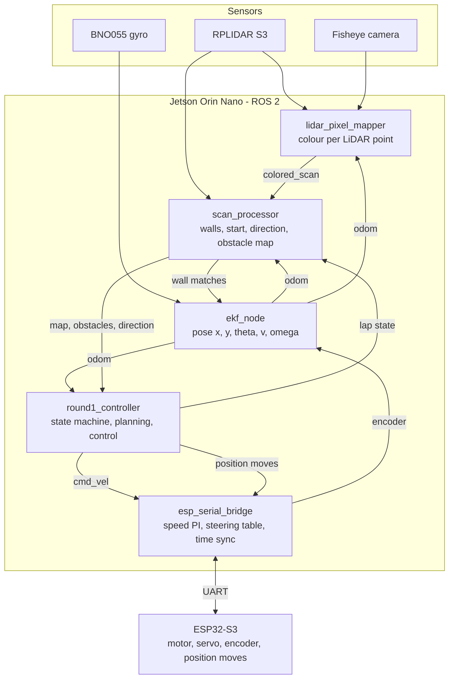
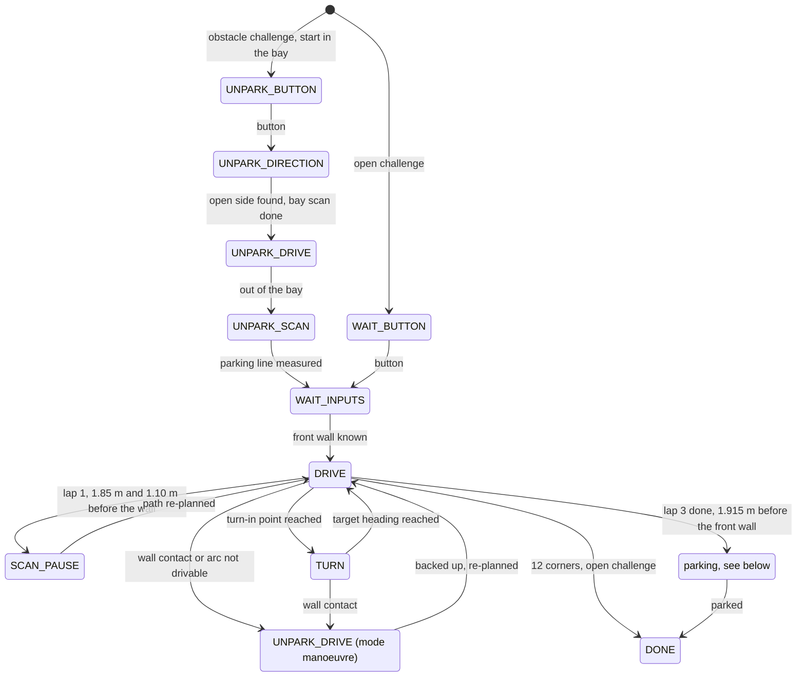
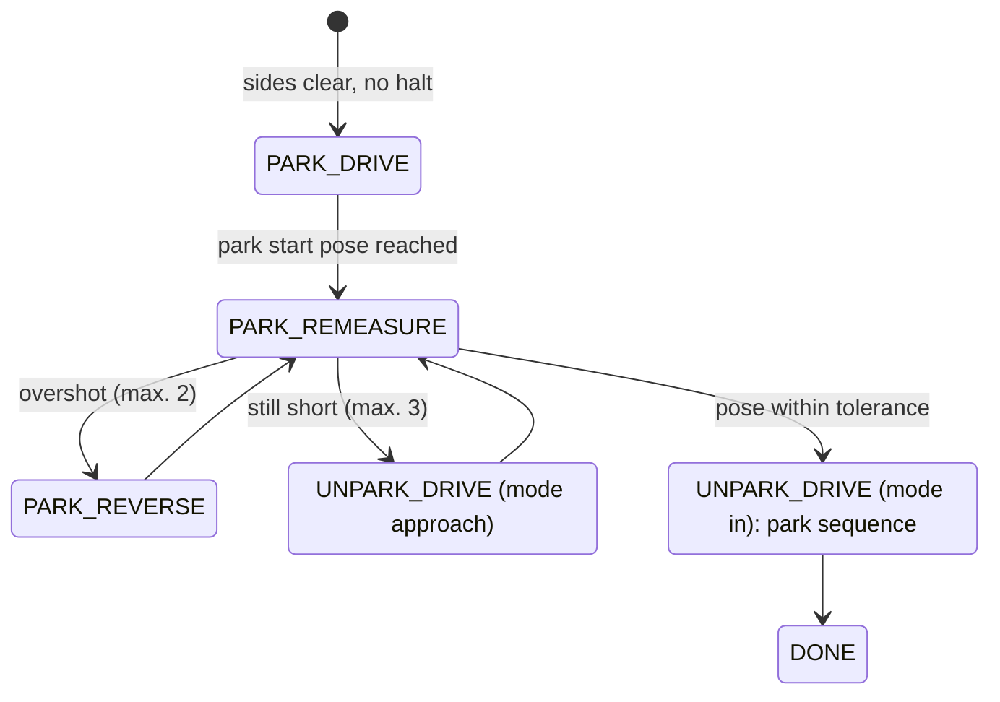
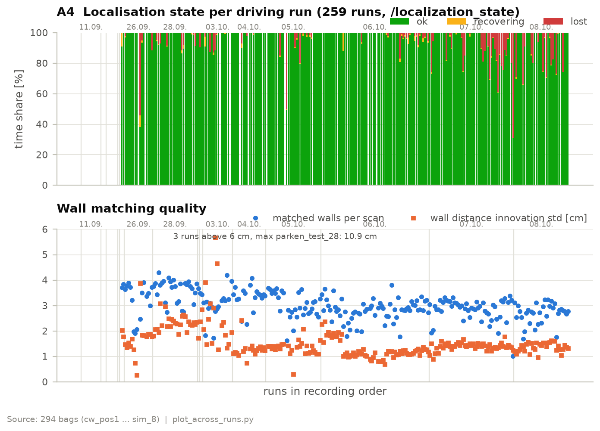
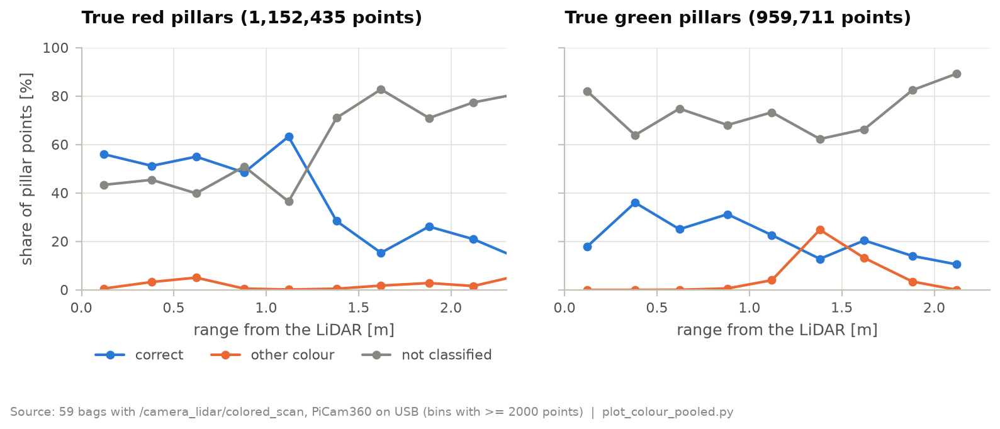
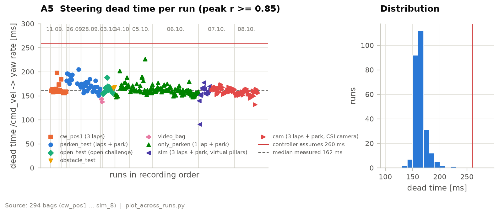
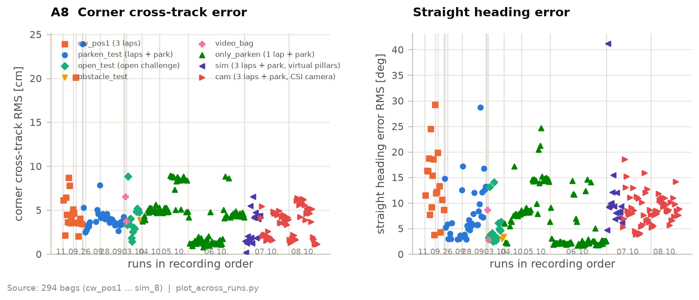
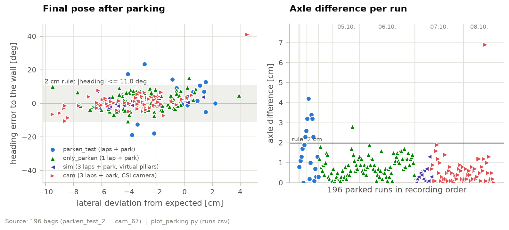
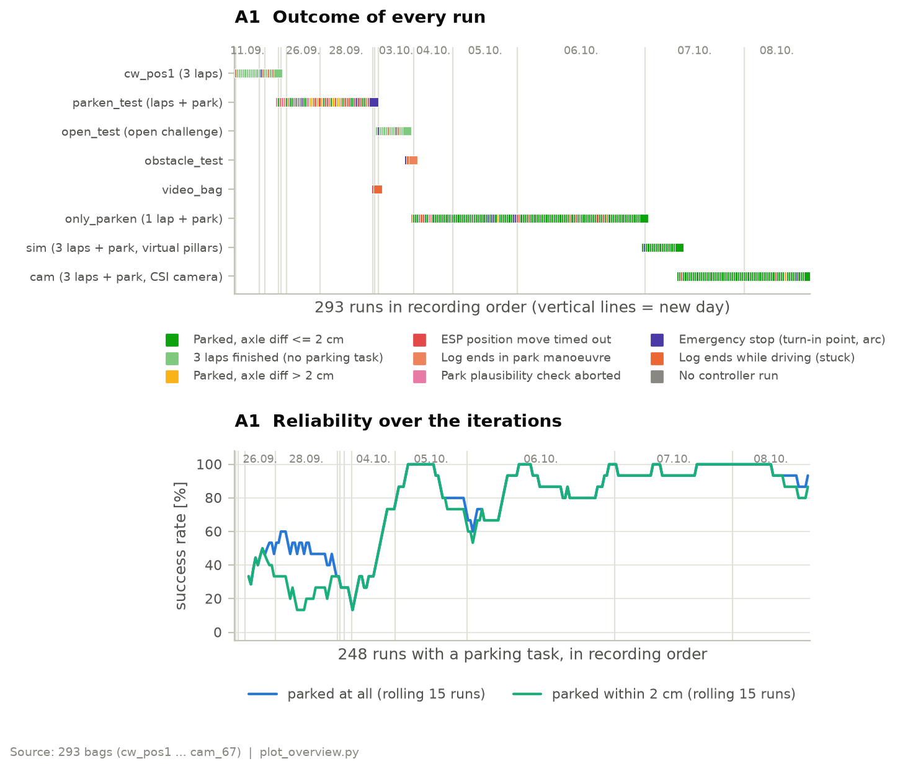
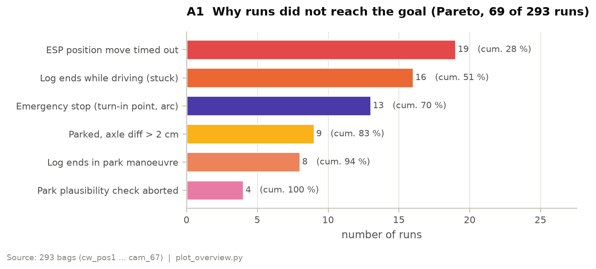

# Software architecture and obstacle strategy

## Architecture overview

The software runs on two controllers. The **Jetson Orin Nano** runs all
perception, estimation, planning and control as ROS 2 Humble nodes (Python)
inside a Docker container (jetson-containers). The **ESP32-S3** drives the
motor and the steering servo, counts the encoder, executes the position moves
used for unparking and parking and stops the motor on its own if the Jetson
falls silent. Both talk over UART (115200 baud) with a binary protocol. The
clocks are synchronised every 10 s (NTP-style ping-pong, least-squares fit of
offset and drift, ESP reboots are detected), so that encoder samples from the
ESP and IMU/LiDAR samples on the Jetson share one time base. Over all
recorded runs the one-way latency from the ESP to the Jetson was 1.6 ms
(median of the run medians, p95 8.2 ms) and the round trip 0.66 ms.

The split follows one rule: everything that needs the map or the camera runs on
the Jetson, everything that must react within milliseconds to the motor runs on
the ESP.

| Node | Code | Rate | Job |
|---|---|---|---|
| `lidar_pixel_mapper` | [`camera_lidar_fusion/lidar_pixel_mapper.py`](../../src/camera_lidar_fusion/camera_lidar_fusion/lidar_pixel_mapper.py) | ≤ 7 Hz | projects every LiDAR point into the fisheye image and gives it a colour label |
| `scan_processor` | [`ekf/scan_processor_node.py`](../../src/ekf/ekf/scan_processor_node.py) | every scan (~15 Hz) | extracts walls, detects start position and direction, keeps the obstacle map, reports the localisation state |
| `ekf_node` | [`ekf/ekf_node.py`](../../src/ekf/ekf/ekf_node.py), [`ekf/ekf.py`](../../src/ekf/ekf/ekf.py) | 50 Hz output | fuses gyro, encoder and wall matches into the pose |
| `round1_controller` | [`ekf/round1_controller_node.py`](../../src/ekf/ekf/round1_controller_node.py) | 30 Hz | state machine, path planning, lane and arc control, unparking and parking |
| `esp_serial_bridge` | [`esp_bridge/esp_serial_bridge.py`](../../src/esp_bridge/esp_bridge/esp_serial_bridge.py) | 100 Hz telemetry | turns `/cmd_vel` into motor and servo commands, speed control, time sync |
| `foxglove_overlay` | [`ekf/foxglove_overlay_node.py`](../../src/ekf/ekf/foxglove_overlay_node.py) | 2–10 Hz | debug view (field, path, obstacles, run timer, CPU) |

The algorithms live in plain Python modules without ROS, so that they can be
unit-tested and replayed against recorded bags:

| Module | Content |
|---|---|
| [`wall_extraction.py`](../../src/ekf/ekf/wall_extraction.py) | clustering, split at corners, line fit, matching against the map |
| [`field_map.py`](../../src/ekf/ekf/field_map.py) | field geometry, the 24 pillar seats |
| [`start_detection.py`](../../src/ekf/ekf/start_detection.py), [`direction_detection.py`](../../src/ekf/ekf/direction_detection.py) | start section and driving direction from the walls |
| [`obstacle_detection.py`](../../src/ekf/ekf/obstacle_detection.py), [`obstacle_map.py`](../../src/ekf/ekf/obstacle_map.py) | pillars from coloured points, voting per seat |
| [`obstacle_path.py`](../../src/ekf/ekf/obstacle_path.py) | lane-change path around the pillars |
| [`unpark.py`](../../src/ekf/ekf/unpark.py), [`move_sequencer.py`](../../src/ekf/ekf/move_sequencer.py) | unpark and park sequences, drive model, dry-run simulation |
| [`colors.py`](../../src/camera_lidar_fusion/camera_lidar_fusion/colors.py), [`fisheye_model.py`](../../src/camera_lidar_fusion/camera_lidar_fusion/fisheye_model.py) | colour classification, fisheye projection |

The main topics between the nodes:

| Topic | From → to | Content |
|---|---|---|
| `/scan` | LiDAR → scan_processor, fusion, controller | raw scan, ~15 Hz |
| `/camera_lidar/colored_scan` | fusion → scan_processor | LiDAR points with colour label |
| `/ekf/odom` | ekf_node → all | pose and velocity |
| `/wall_matches` | scan_processor → ekf_node | walls matched to the map (Hesse normal form) |
| `/wall_distances` | scan_processor → controller | distances to front and side walls (start straight before the map exists) |
| `/front_wall_x` | scan_processor → controller | distance to the front wall at the start (latched) |
| `/race_direction` | scan_processor → controller | clockwise or counter-clockwise (latched) |
| `/corner_geometry` | scan_processor → controller | corners and outer walls of the field (latched) |
| `/inner_geometry` | scan_processor → controller | inner walls, from the start or learned in the open challenge (latched) |
| `/obstacles` | scan_processor → controller | pillar map: voted and snapped to seats |
| `/obstacles_live` | scan_processor → controller | current pillar detections, unfiltered |
| `/localization_state` | scan_processor → controller | `ok` / `recovering` / `lost` |
| `/start_scan_state` | scan_processor → controller | result of the start-straight scan from the bay |
| `/round1_controller/lap_state` | controller → scan_processor | corner and lap counter (lane-width learning, map freeze) |
| `/cmd_vel` | controller → bridge | speed and yaw rate, 30 Hz |
| `/esp_serial_bridge/move` | controller → bridge | ESP position move (distance) |
| `/esp_serial_bridge/move_done` | bridge → controller | acknowledgement of a position move with status |

The whole robot starts from one script ([`src/start_robot.sh`](../../src/start_robot.sh)),
which runs every node in its own tmux window, so that the log of each node stays
readable on the field.

## Run sequence and state machines

The behaviour is split over two state machines. The **controller** decides what
the car does; the **scan_processor** decides what the car knows. They are
separate because they run at different rates (control at 30 Hz, perception per
scan) and because the perception must keep working while the controller stands
still, e.g. during a scan halt.

### Controller

The first diagram shows the race, the second the parking at the end. Emergency
stops can happen from several states and are listed under [Edge cases](#edge-cases)
instead of being drawn.

| State | What it does | Why it is a separate state |
|---|---|---|
| `UNPARK_BUTTON`, `WAIT_BUTTON` | publish stop, wait for the start button | nothing may be measured or moved before the button |
| `UNPARK_DIRECTION` | votes on the open side of the bay from the raw scan (5 agreeing scans), picks the unpark variant | the direction decides the whole run; a contradiction with the perception aborts instead of guessing |
| `UNPARK_DRIVE` | executes ESP position moves (steer, wait, move, wait for the acknowledgement) | the LiDAR sees nothing closer than 0.15 m, and in the bay the nearest wall is exactly there, so these moves run on the encoder, not on the map. The same executor is reused for the back-up manoeuvre and for parking, so there is one tested code path with acknowledgements and timeouts |
| `UNPARK_SCAN` | stands still, measures the parking line, averages the pose; 2.0 s if corner 1 is closer than 1.10 m (then it replaces the scan halt of the first straight), else 0.5 s | the parking target is the pose at the end of unparking; averaging at standstill removes the noise of single scans |
| `WAIT_INPUTS` | waits for the start section (front wall) | the controller cannot plan the first straight without it |
| `DRIVE` | follows the straight (lane or obstacle path), watches the turn-in point, the halts and the finish | one state for everything that is driven with the Stanley law |
| `SCAN_PAUSE` | stands still (look-ahead halt 1.2 s, scan halt 1.5 s), then re-plans | the colour is only reliable at standstill (see Perception) |
| `TURN` | follows the planned arc, ends on the heading | a different control law (curvature feed-forward); the corner ends on the heading, not on a distance |
| `PARK_*` | crawls to the park start pose, re-measures, corrects | parking needs centimetres; every step checks the pose before the next move |
| `DONE` | publishes stop for 1 s, then stays silent | one safe terminal state; the bridge stops the motor when `/cmd_vel` stays silent |

### Perception

The scan_processor has its own states. Each one exists because a decision must
not be taken on a single scan.

| State | Transitions | Why |
|---|---|---|
| Start section | no map → map committed after 5 valid scans (majority of the start section) | one scan can be disturbed by a pillar or a person at the field edge; the map origin must be right, everything else builds on it |
| Direction | open → latched after 5 equal confident results in a row, then frozen | the direction switches the whole map; flipping back and forth would be worse than deciding a few scans later |
| Bay phase | `parked` → `exiting` (moved > 3 cm or turned > 3°, from encoder and gyro) → `clear` (LiDAR out of the bay and heading within 15°, or 1.20 m driven) | while swung out and still partly between the bay walls, pillar votes are only wrong ones, so no votes count in `exiting`; the phase change uses encoder and gyro because the pose jumps when the map is committed |
| Start scan (from the bay) | `scanning` → `complete` when every checked seat is decided, `incomplete` after 2 s or if the robot moves | unparking waits for a proof that the seats in front are free, not for a fixed time; the timeout keeps the run going if a seat stays undecided |
| Gate level | 0 → 3, opening after 4 scans without a match, closing after 5 calm scans; published as `ok` / `recovering` / `lost` | see Localisation |
| Obstacle map | open → frozen after lap 1 | from lap 2 the robot drives faster and colour is unreliable while driving; a frozen map cannot be corrupted by it |

## Localisation

The national-final robot computed its position from every single scan
(wall follower). One missing or wrong scan was enough to lose the lane.
The current robot keeps a continuous pose in a map of the field and only
corrects it with the walls it sees.

**Extended Kalman filter** ([`ekf.py`](../../src/ekf/ekf/ekf.py)). State
$[x, y, \theta, v, \omega, b_g]$ with a midpoint unicycle model for the
prediction. Measurements:

| Measurement | Model | Noise |
|---|---|---|
| gyro yaw rate | $z = \omega + b_g$ | $R = 2.83\cdot10^{-7}$ |
| encoder speed | $z = v$ ($r_\text{eff}$ = 15.0 mm) | $R = 9.3\cdot10^{-4}$ |
| standstill | $\omega = 0$ when $v < 0.03$ m/s and $|\omega_\text{gyro}| < 0.003$ rad/s | $R = 10^{-4}$ |
| wall in Hesse normal form | $\alpha = \alpha_\text{map} - \theta$, $d = d_\text{map} - (x\cos\alpha_\text{map} + y\sin\alpha_\text{map})$ | $\mathrm{diag}(10^{-5}, 3.6\cdot10^{-6})$ |

The gyro scale factor (−0.9674) comes from a calibration over five full turns. Gyro and
encoder samples arrive from two clocks. They are sorted by time stamp in a 15 ms
window before they enter the filter; a sample up to 50 ms late is still applied
without a prediction step, anything later is dropped. The filter updates on
every measurement; the pose is published at 50 Hz and only if something new
was computed, so a failed sensor makes the odometry stop instead of repeating
an old pose.

**Wall extraction** ([`wall_extraction.py`](../../src/ekf/ekf/wall_extraction.py)):
known pillar positions and the parking bay are masked first, so that they cannot
be taken for walls, and points closer than 0.10 m (the own chassis, a pushed
pillar) are dropped. The remaining points are clustered in scan order by gap
(0.15 m, at least 45 points), each cluster is split recursively at the point of
largest deviation until no point is further than 4 cm from its segment (at least
65 points per segment), and every segment gets a total-least-squares line fit
(SVD). A cluster that is short (< 150 points) **and** bent is
dropped (root mean square, RMS, of the point distances to the fitted line
above 6 mm; the RMS is the square root of the mean of the squared deviations): straight walls smear to 4–7 mm in a moving scan, but corner fragments
are short and bent.

The LiDAR delivers the points ordered by angle and the field consists of a few
long straight walls, so this split uses that order directly, is deterministic
and keeps the whole scan callback at about 6 ms (median). Unlike RANSAC or a
Hough transform it returns segments with end points, which we need, e.g. to tell
a 3 m wall from the 20 cm wall of the parking bay. Splitting at corners was
decisive: without it, L-shaped corner clusters produced phantom walls; with it
the heading drift dropped from 25° to ±1.5°.

**Matching** ([`scan_processor_node.py`](../../src/ekf/ekf/scan_processor_node.py))
compares every segment with the walls of the map: a gate on the innovation
(distance and angle) plus an overlap check along the wall, which rejects a
segment that lies completely beyond the end of the map wall. The overlap check
was added after run `parken_test_20`, where a pushed pillar 60 cm past the end of
the inner wall was matched to it and the pose stuck 50 cm behind.

If no wall matches for 4 scans, the gate opens in steps of 3 scans
(0.12 m/20° → 0.20/25° → 0.28/30° → 0.35/35°, overlap tolerance 0.15 → 0.45 m);
the wide levels need at least two matching walls, and after 5 calm scans the gate
closes again. We first derived the gate from the EKF covariance, but without wall
corrections the covariance grew from only 0.2 to 5.8 cm in 30 s while the real
error grew to metres. With the steps, the worst case from level 0 to 3 is 10
scans (about 0.7 s); before, one test run needed 2.6 s from level 2 to 3 alone
and drove 1.2 m blind. The gate level is published as the localisation state
(`ok`, `recovering`, `lost` at the widest level) and used by the controller.

**Latency.** Wall corrections once reached the EKF 0.35–0.6 s after their scan; in
a 90°/s corner that is 30–50° of heading, and every late correction pulled the
heading back. The causes were a queue of old scans in front of the single-threaded
node and a pillar clustering that compared all point pairs. Now the node keeps
only the newest scan (queue depth 1) and the pillar clustering uses a 4 cm grid.
Wall matches are still applied with the current pose, not the pose at scan time.

**Result.** In the 42 driving runs with a recorded localisation state, the
state was `ok` for 100 % of the time in the median (mean 96.3 %). On average
3.7 walls were matched per scan; the innovation of the wall distance had a
standard deviation of 2.2 cm, of the wall angle 2.7°. `lost` occurred in 13 runs,
in 5 of the 6 runs with a logged transition only after parking had started,
because inside the bay the LiDAR sees only 0–2 walls. The only run that lost the
localisation during the race was `parken_test_14` (the duplicate scan_processor,
see [Edge cases](#edge-cases)).

## Perception: start, direction, pillars and colour

### Start section

[`start_detection.py`](../../src/ekf/ekf/start_detection.py): the front wall and the two side walls are taken from the extracted walls. The
distance to the front wall gives the start section. In the obstacle challenge
the robot starts in the parking bay; there the bay walls would be closer than
the front wall, so a front wall must be at least 0.50 m long and 0.60 m away
(before this rule, a bay wall was once taken as the front wall and the map lay
0.9 m off).

### Direction

[`direction_detection.py`](../../src/ekf/ekf/direction_detection.py): the front
wall is intersected with each side wall. On the open side (where the
inner wall ends) the front wall reaches more than 0.10 m past that intersection.
Right open and left closed means clockwise, and vice versa. This already works
on the start straight as soon as the far corner is visible: in one run the right
side opened at $x = 0.84$ m and the direction latched at $x = 1.02$ m. The map
is switched to the full field at the latest 0.40 m before the front wall.

### Colour

[`lidar_pixel_mapper.py`](../../src/camera_lidar_fusion/camera_lidar_fusion/lidar_pixel_mapper.py):
the fisheye camera sits above the LiDAR with its lens facing the ceiling
(since October a Waveshare IMX219-200 on the CSI port, 208° calibrated; before
that a PiCam360 on USB, 197°; see chapter 2). At the rear a circuit board
blocks the view of the LiDAR and the camera alike (measured from −33° to +59°
around the rear). The software cuts this sector symmetrically at ±60° and uses
only the front 240° for walls, pillars and colour. Instead of detecting
pillars in the image, every LiDAR point is projected into the image
(equidistant fisheye model $r = f\theta$, image circle found by a least-squares
circle fit) and the pixels around it vote for a colour label. Before the
projection, each point is moved to the time stamp of the image with the EKF pose
history, so that the robot's own motion does not shift the colours. Red and green
are separated by the index $(G - R)/\max(R, G, B)$ with a saturation gate and a
minimum of $|G - R| \ge 10$, after a white-point correction measured on the white
mat in 12 sectors. Only red and green are searched; magenta is switched off (see
[Edge cases](#edge-cases)). The result is a point cloud with a colour per LiDAR point, so every
pillar has a distance and a colour at the same time. The camera delivers 15 fps;
the fusion is limited to 7 Hz to leave CPU for estimation and control.

### Pillars

[`obstacle_map.py`](../../src/ekf/ekf/obstacle_map.py): pillars are found by
region growing on the red/green points (4 cm grid, at least 5 points, at most
9 cm extent) and snapped to the 24 seats the rules allow (at most 12 cm away).
The map is a vote per seat:

- A seat is occupied after 3 votes.
- Colour only counts within 1.60 m; votes from further away only count as
  "something there". The limit comes from a test with a red pillar on seat 0:

  | Distance | 0–0.8 m | 0.8–1.2 m | 1.2–1.6 m | 1.6–2.0 m | 2.0–3.0 m |
  |---|---|---|---|---|---|
  | votes red / green | 12 / 0 | 10 / 0 | 10 / 0 | 2 / 8 | 0 / 16 |

- At yaw rates above 0.6 rad/s no colour is counted (occupancy still is).
- At most 2 pillars per straight; the weaker of two seats in the same row needs
  at least 35 % of the votes of the stronger one.
- A seat the LiDAR sees through 6 times in a row (range ≤ 1.20 m, localisation
  `ok`, yaw rate ≤ 0.5 rad/s, see-throughs at least twice the hits) is cleared
  again. This removed the phantom pillars of earlier runs.
- After lap 1 the map is frozen.

Besides the voted map, the current detections are published unfiltered
(`/obstacles_live`); they are used for the dodge on the start straight and to
mask pillars before the wall extraction.

Why the fisheye instead of the old 120° camera: at the scan halt 1.10 m
before the front wall, the 120° camera sees 3 of the 6 seats of the next
straight, the fisheye with the 240° it uses all 6 (5 of them within the 1.60 m
colour range, against 3 for the old camera). The robot can plan the next straight before it
turns.

Pooled over 59 bags (1.15 million points on red, 0.96 million on green pillars,
reference: the robot's own final map), red is classified correctly for 48–63 %
of its points up to 1.1 m and almost never as the other colour (at most 5 %).
Green is recognised less often (18–36 % up to 1 m), and at 1.4 m 25 % of its
points are read as red, at 1.6 m still 13 %. A wrong colour is more dangerous
than no colour, which is why a seat needs several votes and the colour is the
majority of the close votes. The share of "not classified" points says little
on its own: the reference is the robot's own map, and most points were recorded
while driving, when only a small share of points gets a colour at all. The
reliable figure is the wrong-colour rate.

## Lane following

**Straights** are followed with the **Stanley** law on a reference line (lane
centre or obstacle path):

$$\delta = k_h\,\frac{v_\text{ref}}{v}\,e_\theta + \arctan\frac{k\,e_{ct}}{v} + \delta_\text{ff}$$

with $k = 1.2$, $k_h = 1.0$, $v_\text{ref} = 0.45$ m/s, the curvature
feed-forward $\delta_\text{ff} = \arctan(L\kappa)$ of the path and at most 25°.
Scaling the heading gain with $1/v$ keeps the time constant of the heading loop
the same at every speed. We started with a PD law on lateral and heading error
that commanded a yaw rate; it had problems with the lateral offset, and Stanley
turns both errors directly into a steering angle for a front-steered car.

Two additions came from test runs:

- **Dead-time prediction.** With the short wheelbase (0.10 m) the heading
  reacts fast (3.5 rad/s yaw rate per radian of steering), and with the delay
  between command and reaction only about 28° phase margin remained: every
  disturbance rang out with a period of about 1 s. The controller therefore
  predicts the pose for the moment a command computed now takes effect: it
  integrates the commands of the last 260 ms (`steer_dead_time`) with the
  measured steering gain. In simulation the steering oscillation dropped from
  ±18° to ±2°. The 260 ms come from two early measurements (241 and 260 ms) and
  were not re-tuned; four later runs, evaluated by cross-correlation, confirm
  them within 10 %:
  - command → gyro reaction: 190 ms on average, including the travel time of
    the steering servo (the first reaction comes earlier);
  - gyro → EKF pose: another 26–34 ms (15 ms sorting window, 50 Hz output);
  - EKF pose → used by the controller (30 Hz): another ~16 ms on average.

  The effective dead time is therefore about 235–250 ms, and the 260 ms set in
  the controller lie 10–25 ms above it. The evaluation of all bags gives
  167 ms (median over 55 runs) for the first stage alone, measured on the
  recorder's time stamps; with the two other stages that would be about
  210 ms. Since the steering calibration was updated (22.09.), the measured
  yaw-rate gain is 1.13 instead of the 0.84 used in the prediction, i.e. the
  car turns in more than the predictor assumes.
- **Smoothed steering pose.** Wall corrections move the pose by 1–1.5 cm several
  times per second, which gave 2–3° steering jumps on calm straights. For the
  steering law they are blended in over 0.30 s; larger jumps are taken over at
  once.

**Corners** are tangential circular arcs between the entry and exit lane lines
and are driven in the state `TURN` with their own law: the feed-forward
curvature $1/R$ plus corrections for the radial error ($k_{ct} = 8.0$) and the
heading error to the tangent ($k_{\theta} = 2.5$). A constant curvature gives a
constant feed-forward, and entry and exit points follow exactly from the walls.
Three details came from test runs:

- The command is computed as a curvature and turned into a yaw rate with the
  same measured speed the bridge divides by again, so the speed cancels out.
  Before, starting a corner from standstill turned a yaw rate of 0.85 rad/s at
  0.05 m/s into 58° steering, i.e. full lock.
- The corner is computed with the predicted pose (dead time), and it ends on the
  predicted heading; ended on the measured heading, it kept turning 13–34°.
- The feed-forward is blended out over the last 20° instead of 7°: 7° at
  1.5 rad/s are only 80 ms, less than the dead time. In simulation the
  overshoot dropped from 6.5° to 1°.

$R = 0.50$ m puts the arc centre on the inner corner of a 1 m lane when driving
on the lane centre; with a short run-up the radius shrinks down to 0.30 m, which
keeps a margin above the smallest drivable radius of about 0.22 m
($L / \tan 25°$). The turn-in point is triggered $v \cdot 0.26$ s early. Within
0.5 m before it, the robot slows to 0.25 m/s if it is still more than 7 cm off
the line or steering harder than 0.5 rad/s, and on a disturbed entry the arc is
re-anchored at the actual pose.

The bridge ([`esp_serial_bridge.py`](../../src/esp_bridge/esp_bridge/esp_serial_bridge.py))
converts the commanded yaw rate into a steering angle with a **measured steering
table** per speed (0.35 / 0.50 / 0.75 m/s, [`steer_lut.py`](../../src/esp_bridge/esp_bridge/steer_lut.py)),
because the servo-to-wheel-angle curve is neither linear nor symmetric: at
0.35 m/s full lock is +21.9° to the left and −24.7° to the right, the right side
steers about 40 % more per servo percent, and at +35 % servo the curve deviates
3.3° from a straight line. At 0.75 m/s left full lock drops to 19.4°.

The table is measured with
[`steer_calib_node.py`](../../src/ekf/ekf/steer_calib_node.py): the car drives
circles with a fixed servo command at each of the three speeds, and the
effective wheel angle is calculated from the measured yaw rate $\omega$ and
speed $v$ as $\delta = \arctan(L\,\omega / v)$. The figure below shows the
result in three ways:

- **Steering angle:** the effective wheel angle $\delta$ over the servo command,
  one line per speed. The curve is steeper to the right (negative) than to the
  left, and at high speed the car reaches less effective lock, presumably because
  the tyres slip more.
- **Curvature:** the same data as path curvature $\tan\delta / L$ in 1/m, which
  is what the controller actually asks for. At full lock the car drives a
  circle of about 0.22–0.25 m radius (curvature 4–4.5 1/m).
- **Nonlinearity per side:** the deviation of each point from a straight line
  fitted separately for the left and the right side. A linear steering model
  would be wrong by up to 3.3° (at +35 % servo) and about 2° near full lock.
  This is why the bridge interpolates in the measured table instead of using
  one gain per side.

The driving speed is controlled on the Jetson
(PI with feed-forward, 50 Hz, acceleration limited to 0.8 m/s²) on the EKF speed.
The position moves for unparking and parking run on the ESP32 with its own PID
directly on the encoder: there the controller sits at the source and has no
round trip through the serial link, so it reacts faster and stops more
precisely.

**Tracking accuracy.** For every run the error is summarised as its RMS over the
run (square root of the mean squared error), which weights large deviations more
than a plain mean. The lateral error to the planned arc was 3.9 cm RMS in the
median of the runs (4.3 cm in the `cw_pos1` series); the four runs above 18 cm
all ended early (stuck turn, emergency stop). On the straights the heading error
was 5.8° RMS (12.8° in `cw_pos1`), including the lane changes around pillars.
The lateral error on the straights was not recorded, because its debug topic
was switched off.

## Obstacle strategy

**Side rule.** Red pillars are passed on the right, green pillars on the left.
The planner ([`obstacle_path.py`](../../src/ekf/ekf/obstacle_path.py)) works in
lane coordinates ($s$ along the straight, $q$ from the outer wall), where the
rule becomes a choice between the outer and the inner side: driving
counter-clockwise the outer wall is on the right, so red is passed on the
outside; driving clockwise the outer wall is on the left, so green is passed on
the outside. A pillar whose colour is still unknown is treated as red.

**Path.** For every pillar the target offset lies midway between the pillar and
the wall (or the neighbouring pillar); the robot centre stays at least 12 cm
from the wall. The robot must be on that offset 20 cm before the pillar and hold
it until 5 cm after it. Lane changes are cosine ramps (0.40 m minimum, 0.70 m
preferred length); shifts below 3 cm are ignored, and if two pillars follow each
other closely, the robot keeps its lane when it still passes the next pillar
with 8 cm clearance. The ramps are tangential at both ends, so Stanley sees no
heading step; a front-loaded variant was rejected because of a kink of about
15°. The path is re-planned whenever the obstacle map changes and after every
scan halt.

**Corners with pillars.** The side before and after a corner comes from the
nearest pillar on the straight before and after it. The arc is checked against
the car outline; if a pillar is closer than 8 cm, the radius is searched between
0.30 and 0.70 m, as close to the planned radius as possible. If a pillar behind
the corner only appears after the arc was planned, the corner is planned again.

**End of the side rule.** After three laps the robot has to park, and the pillars
no longer bind it once it has passed them. The controller switches when the rear
axle is 1.915 m from the front wall: the rear is then past the pillar row at the
beginning of the start straight (2 m). From there it plans freely to the parking
line and holds its lane only until the pillars beside it are behind its rear; if
the swing onto the parking line does not fit before the park start pose, it
drives past it and backs up. For the same reason the last corner ignores pillars
behind the switching point, otherwise a pillar at the end of the start straight
pulled the arc onto the inner line.

**Speed.** The speed profile `fast` sets 0.35 m/s on the start
straight, 0.75 m/s on straights without pillars, 0.55 m/s in corners and on
straights with pillars, 0.35 m/s on steep lane changes and 0.30 m/s on the last
corner and the finish straight. Almost all test runs evaluated below were
driven before, with a cruise speed of 0.35 m/s.
Before every halt the robot brakes along $v = \sqrt{2ad}$, and the halt is
triggered early by the coasting distance $v \cdot 0.10\,\text{s} + v^2/(2 \cdot 0.57\,\text{m/s}^2)$.

## Open challenge

The inner walls are unknown at the start. After the button the robot measures
its start section and the lane width at standstill and builds a reduced map of
the three walls it sees. The widths 0.60 and 1.00 m are only used to check that
a measurement is plausible (±0.15 m); map and start pose use the measured
distances, because the lane width may vary. The direction is detected on the
start straight (see [Direction](#direction)). While driving the robot measures the width of
every straight (sum of both side distances) and, as soon as all four are known,
reconstructs the inner walls from the median widths and adds them to the map.
About 27 s for three laps.

## Obstacle challenge

The robot starts in the parking bay. After the button it checks from the bay the
seats of the start straight that lie up to 0.75 m ahead in the inner column (one
seat counter-clockwise, two clockwise; the far seats cannot be seen from the
bay). A seat is free after 5 see-throughs with at most a quarter as many hits;
it can also be occupied (red, green or colour unknown) or stay open. The robot
votes on the open side of the bay and chooses one of three unpark sequences
depending on the nearest pillar 0.10–0.75 m in front of it.

Lap 1 is the scanning lap: a short look-ahead halt 1.85 m and a scan halt
1.10 m before each front wall, because the camera only gives reliable colour at
standstill (while driving the frame rate drops from 15.5 to 2.5 Hz and the share
of coloured points from 38 to 2 %). The look-ahead halt is skipped if it would
come less than 0.25 m before the scan halt. The robot collects detections from
every halt and while driving, and the path is re-planned after every halt. From
lap 2 the map is frozen and the robot drives the planned path without halts.
After three laps it parks without stopping first: the time runs until the robot
stands in the bay, and the rules do not ask for a pause. About 80 s for the
whole run.

## Parking and unparking

The start in the bay and the parking at the end use the same model
([`unpark.py`](../../src/ekf/ekf/unpark.py)): a drive model that turns a sequence
of moves (steering, distance) into poses.

- **Unparking** is a fixed sequence of moves run by the ESP with the encoder.
  Positive steering always means "towards the open side", so one table serves
  both directions. The variant (inner / middle / outer) depends on the nearest
  pillar in front of the robot, not on a fixed pillar row: the bay lies 1.25 to
  1.97 m from the front wall depending on the layout, and with a fixed row a
  green pillar 28 cm in front of the robot was missed. Before driving, the
  sequence is simulated against the bay dimensions; the result is logged as a
  warning, because the real bay can differ from the model.
- **Park start pose.** The map origin is the pose in the bay, so the bay position
  is known exactly at the end. After the normal unpark sequence, the park start
  pose is the pose where unparking ended (averaged in `UNPARK_SCAN`, plus the
  measured parking line and an offset per direction). After a variant, the robot
  does not stand where the park sequence begins; the park start pose is then the
  bay pose plus the measured end pose of the normal sequence.
- **Approach.** From 1.915 m before the front wall the robot drives at 0.15 m/s
  under closed-loop control to the park start pose, re-measures, and backs up in
  one controlled reverse move if it overshot (reverse law
  $\delta = 1.5\,\psi - 6.7\,e$, because Stanley is unstable backwards; in
  simulation 0.4 cm final error instead of 3.4 cm with a blind move). Clockwise it
  may drive up to 30 cm past the start pose, shortened by any pillar on the
  parking line; counter-clockwise this is off, because in run 48 it left −7°
  heading and the next move touched the magenta wall.
- **Park sequence.** Parking uses its own sequence per direction (`STEPS_PARK_CW`,
  `STEPS_PARK_CCW`), derived from the reversed normal unpark sequence with short
  correction moves. The target heading at every move boundary comes from the
  drive model. While localisation is `ok` and the robot is at least 0.23 m from
  the outer wall, the next move is lengthened or shortened (at most ±40 %) when
  the heading deviates; deeper in the bay the moves run as planned. Forward moves
  are 1.5 cm shorter, because the ESP overshoots about 1.1 cm forwards but only
  0.4 cm backwards (one run hit the wall after 3.3 of 4.5 cm). Moves without
  travel are skipped.

| Runs | Within 2 cm | Median axle difference | Median heading error | Median lateral deviation |
|---|---|---|---|---|
| 2–19 | 6 / 8 | 1.5 cm | 8.0° | 1.3 cm |
| 22–33 | 2 / 7 | 3.2 cm | 17.5° | 2.9 cm |
| 35–46 (heading correction at the start pose, closed-loop reverse) | 5 / 5 | 0.3 cm | 1.7° | 0.6 cm |

The 2 cm rule (axle difference $= 0.105\,\text{m}\cdot|\sin\psi|$) depends only
on the heading and is met for $|\psi| \le 11°$; the lateral deviation stayed
within ±5 cm in all 20 runs. The heading correction at the start pose appears in
the logs from run 35, the closed-loop reverse from run 38. Values are the
robot's own estimate (EKF), not measured with a ruler.

## Edge cases

| Case | Handling |
|---|---|
| Pillar in or near the corner | side before/after the corner from the nearest pillar; radius searched between 0.30 and 0.70 m for 8 cm clearance; re-plan if a pillar appears after planning |
| Pillar seen late | path re-planned on every map change; slower on steep lane changes; look-ahead halt in lap 1 |
| Unknown colour | treated as red; on the start straight before the direction is known, the side with more room is taken |
| Pillar of the next straight in the unpark decision | with the front wall close, a pillar of the next straight can be less than 0.75 m in front of the robot; it is excluded by its lateral position (it must lie in the start lane), not only by its wall |
| Magenta bay walls | colour search only for red/green; bay walls masked geometrically out of wall matching; no pillars accepted in the outer column of the start straight |
| Bay wall taken as front wall | front wall must be ≥ 0.50 m long and ≥ 0.60 m away |
| Pushed pillar beyond a wall end | overlap check along the wall |
| People / objects outside the field | colour only for LiDAR points; a pillar only enters the map within 12 cm of one of the 24 seats |
| Localisation lost | gate opens in steps; max. 0.20 m/s while `recovering` or `lost`; emergency stop after 2 s `lost` |
| Gyro failure (I2C) | no messages > 0.5 s or exact zeros > 1 s → `gyro_ok = false`; the run does not start without it |
| Odometry gaps | the controller repeats its last command; the bridge stops the motor after 0.5 s without `/ekf/odom` or `/cmd_vel`; the ESP itself stops after 5 s without a packet |
| Contradicting direction | unparking does not start |
| Turn-in point missed | re-anchor the arc; if not drivable: back up and re-plan (same budget of two manoeuvres per corner as below); more than 0.5 m past or 0.6 m beside: emergency stop |
| Touching a wall or pillar | 3 LiDAR points within 4 cm in front of the nose: stop, back up 8–40 cm while steering towards the direction of the straight, re-plan and drive on. At most two such manoeuvres per corner (the counter is shared with the missed turn-in and reset after every corner); a third one ends the run with an emergency stop instead of pushing against the wall |
| Robot moved before the start, map of the previous run | before every run the controller restarts ekf_node and scan_processor and waits up to 40 s for gyro, map and localisation `ok` |
| Duplicate nodes | ekf_node and the controller check at start whether their output topic is already served |

## Testing and tuning

Every test run is recorded as a bag (`parken_test_1` … `_49`, before that
`cw_pos1_N`) with all topics except the camera image. Runs are evaluated offline:
log, path against pillars, LiDAR distances, camera colour per pillar over time,
stopping distance, CPU per core and process. New rules are replayed against old
runs before they go on the robot. Two examples: the see-through votes were
tested on the failed bags with phantom pillars and removed them there; the
collision guard fires exactly at the wall contact of run 49 and never in run 48.

Physical parameters come from calibration tools:

| Tool | Calibrates |
|---|---|
| [`steer_calib_node.py`](../../src/ekf/ekf/steer_calib_node.py) | steering characteristic per speed |
| [`speed_calib_node.py`](../../src/ekf/ekf/speed_calib_node.py), [`speed_verify.py`](../../src/ekf/ekf/speed_verify.py) | speed feed-forward and check |
| [`camera_exposure_calib.py`](../../src/camera_lidar_fusion/camera_lidar_fusion/camera_exposure_calib.py) | exposure, gain and white balance on the white mat |
| [`rotation_calibration.py`](../../src/camera_lidar_fusion/camera_lidar_fusion/rotation_calibration.py) | rotation camera to LiDAR |
| [`unpark_variants_node.py`](../../src/ekf/ekf/unpark_variants_node.py) | single unpark sequences, dry run and on the robot |

Geometry and logic are covered by unit tests (`src/ekf/ekf/test_*.py`,
`src/camera_lidar_fusion/test/`): unparking sequence, reversal, obstacle path,
arc, anchoring, wall matching, colours, fisheye model, white point, blind
sectors. The reasoning behind a parameter is written as a comment next to it,
with the measured value and the run it came from; the controller alone refers to
specific test runs 14 times. The evaluation scripts are in `docs/analysis`.

### Results over all test runs

The outcome of every run is taken from its log (`summarize_runs.py`). 71 bags
from 11.–29.09. were evaluated: `cw_pos1_1…22` (race only, three laps) and
`parken_test_1…49` (race and parking).

| Series | Result |
|---|---|
| `cw_pos1` (race only) | 17 of 22 runs finished three laps (77 %) |
| `parken_test` (race and parking) | 20 of 45 runs parked (44 %), 13 of them within 2 cm (29 %) |
| `parken_test_35…46` | 5 of 5 parked runs within 2 cm |

The most frequent cause of failure is not the parking geometry but the ESP
position moves: in 10 runs (27 % of all failures) a move did not reach its
target before the 4 s timeout. In the last block (runs 34–49) parking was precise
whenever the robot got there, but only 5 of 16 runs got that far. Eight runs end
in the log while driving without an emergency stop; in `parken_test_20` and `_36`
the turn was stuck at about 70° heading error. Four runs ended with an emergency
stop at a corner, e.g. `parken_test_42`: a red pillar stood in the arc of corner
3, no radius kept 8 cm clearance, the obstacle path led far outwards and the
turn-in point was missed by 1.46 m sideways.

Almost all of these runs were driven with a cruise speed of 0.35 m/s; the
faster speed profile (0.75 m/s on straights) was only set afterwards (commit
3f3a22d).

