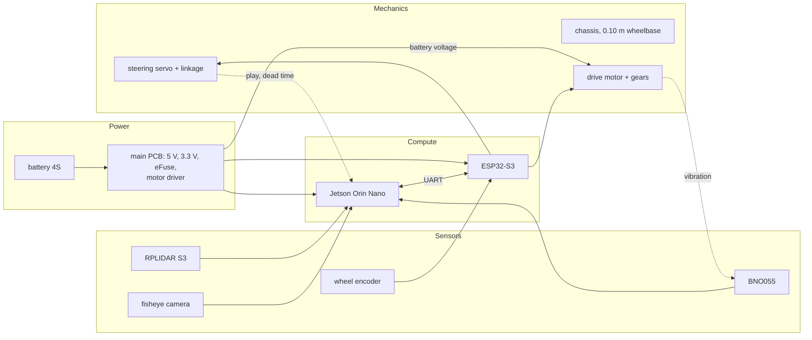
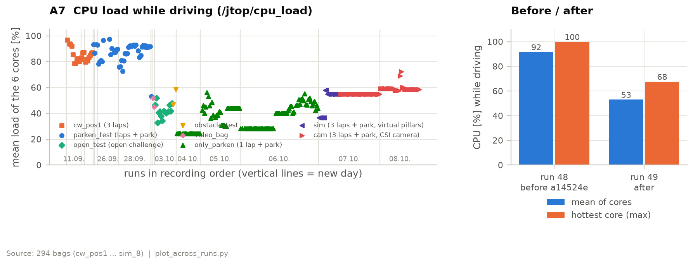

# Systems thinking and engineering decisions

## Subsystems and how they interact

The table lists the interfaces where one subsystem forced a decision in another.
Most of the software described in chapter 3 is a reaction to one of these rows.

| Interface | What we found | Consequence |
|---|---|---|
| Steering linkage → control | servo-to-wheel curve not linear and not symmetric: full lock +21.9° left, −24.7° right at 0.35 m/s, 19.4° left at 0.75 m/s; right steers ~40 % more per servo percent | measured steering table per speed in the bridge; arcs planned with R ≥ 0.30 m, well above the drivable minimum |
| Short wheelbase → control | about 250 ms from command to effect in the pose (servo, gyro, EKF, control loop); with 0.10 m wheelbase only ~28° phase margin, disturbances ring out with ~1 s period | dead-time prediction in both control laws |
| Encoder → power | with the encoder closing the speed loop, the motor voltage no longer has to be constant | the 12 V motor rail was removed from the PCB (chapter 2) |
| Jetson → power | the Jetson draws 76 % of the idle current; driving adds only 18 % | runtime is almost independent of speed, so speed is limited by control, not by energy |
| Jetson CPU → perception | fusion, estimation and control share six cores (~92 % load); scans waiting in a queue made wall corrections 0.35–0.6 s late | fusion limited to 7 Hz, CPU load down to ~53 %; scan queue depth 1 and grid clustering for the latency |
| Camera → strategy | while driving the camera frame rate drops from 15.5 to 2.5 Hz and coloured points from 38 to 2 % | scan halts in lap 1 only; map frozen after lap 1 |
| Camera and LiDAR placement → perception | the camera sits above the LiDAR, lens facing the ceiling; a board at the rear blocks both, so the software uses the same front 240° of both | every LiDAR point in view gets a colour; one rotation calibration links both |
| LiDAR minimum range → unparking | the LiDAR sees nothing closer than 0.15 m, the bay walls are exactly there | unparking and the last parking moves run as encoder moves on the ESP |
| Serial link → motor control | a round trip Jetson ↔ ESP adds delay | position moves controlled on the ESP, driving speed on the Jetson where the EKF speed is |
| Drive gear vibration → IMU | pitch noise grew with speed up to 3.4 °/s; the cause was an adapter running out of true (chapter 2) | the adapter was fixed (−86 % pitch noise at 0.2 m/s); the EKF uses only yaw, which stayed below 0.1 °/s |
| Motor current sense → safety | the current signal stays in the ADC's dead zone (chapter 2) | wall contact is detected with the LiDAR instead (4 cm in front of the nose) |
| ESP move overshoot → parking | position moves overshoot ~1.1 cm forwards but only 0.4 cm backwards | forward parking moves are 1.5 cm shorter |
| ESP position moves → reliability | a move that does not reach its target within 4 s aborts the run: 19 of 69 failed runs | open, see Risks |
| Start pose in the bay → whole run | the map origin is the pose in the bay; parking returns to it | estimation restarted before every run; the robot must not be moved after it |
| Jetson module → chassis | the module (69.6 mm long) and its carrier board set the length of the chassis | motor lengthways in the strip beside the module, battery above it ([chapter 1](02-mobility.md#layout-in-four-levels)) |
| Rigid rear axle → steering and software | the rear wheels scrub in tight corners; the driven full lock is 22–25° instead of the static 37° | measured steering table per speed; planner keeps every arc at R ≥ 0.30 m ([chapter 1](02-mobility.md#steering-angle-while-driving)) |
| LiDAR height → field | scan plane at 55 mm against 100 mm walls leaves ±0.9° of tilt before the beam misses a far wall | LiDAR screwed rigidly to the monocoque, no isolation ([chapter 2](03-power-sensors.md#lidar-placement)) |
| Body → camera and LiDAR | the body carries the camera and must not cut into the scan plane | free space around the scan plane as a design boundary; body located and powered by pogo pins ([chapter 1](02-mobility.md#body)) |
| Tyre compression → encoder | the Shore A 35 silicone is compressed under load: 30.0 mm effective instead of 32 mm diameter | encoder calibrated on the driven distance, not on the mould diameter ([chapter 1](02-mobility.md#tires)) |

## Constraints

| Constraint | Consequence |
|---|---|
| Ties are broken by time. At the German national final the sum of the best open and obstacle challenge times decided (same points as two other teams, 4th place on time); the international rules compare the points and then the time of the best obstacle round, the open challenge time only comes last | faster driving, above all in the obstacle challenge, needed a pose that does not depend on every single scan → EKF |
| The time runs until the robot stands in the bay, the international rules ask for no pause. The German rules differ: a 3 s stop after three laps, the time is taken there, and parking only has to be finished within the 3 minutes | no halt before parking; approach under closed-loop control instead of a stop and a blind move |
| Vehicle size: at most 300 × 200 mm and 300 mm high (general rules 9.17) | not the binding limit: Napoleon measures 182 × 111 × 84 mm with its body. What fixed the size was the Jetson: the developer kit set the size of the national-final robot (170 × 140 mm), the module on the smaller Seeed A603 carrier allowed the new chassis ([chapter 1](02-mobility.md)) |
| Vehicle mass: at most 1.5 kg (general rules 11.2) | 586 g without body (national final: 803 g); the low and light vehicle is limited by traction, not by the motor, and slides before it tips ([chapter 1](02-mobility.md#speed-and-acceleration)) |
| Energy: one 4S pack of 450 mAh in races; the Jetson draws 76 % of the idle current | 10 min to the low-voltage warning on the race pack, almost independent of the driving speed; the 5 V rail carries ≈0.7 A, the figure the eFuse limit is set against ([chapter 2](03-power-sensors.md#power-budget)) |
| International instead of German rules: up to two pillars per straight instead of exactly one; parking after the three laps is part of the obstacle challenge and must be parallel, otherwise the points of the round are halved (German rules: optional extra task, no parallel requirement) | pillar map with two seats per row and the 35 % rule; path planning around two pillars per straight; parking with a measured parallel error (axle difference) instead of only ending between the walls |
| Points before time: a run that fails costs more than a slow one | scan halts in lap 1 accepted although they cost time |
| Colour is only reliable at standstill (frame rate 15.5 → 2.5 Hz, coloured points 38 → 2 % while driving) | scan halts in lap 1 only; map frozen after lap 1 |
| Colour only reliable up to 1.60 m (red read as green beyond ~1.7 m) | votes from further away count as "something there" only |
| Six CPU cores shared by fusion, estimation and control | CPU load while driving reduced from 91.7 % to 53.1 % (commit a14524e, runs 48/49) |
| Wall corrections arrived 0.35–0.6 s after their scan (30–50° heading in a 90°/s corner) | queue depth 1 and grid clustering; remaining latency not compensated |
| The field is fourfold symmetric | global scan matching finds poses rotated by 90°; the start pose must come from start detection |
| Steering: 0.10 m wheelbase, 19–25° full lock, ~250 ms dead time | smallest drivable radius ~0.22 m; arcs ≥ 0.30 m; dead-time prediction |
| LiDAR blind below 0.15 m | encoder moves in the bay |
| Start procedure (rules 9.10–9.14): one switch, one start button, nothing measured before it | container and controller start from the autostart (boot 85–90 s) and wait for the button; direction, position and bay are detected after it |

## Decisions and trade-offs

| Decision | Alternatives considered | Why | Evidence |
|---|---|---|---|
| EKF with wall features | pose from every scan (wall follower, national final); ICP scan matching; particle filter | gyro and encoder bridge missing or wrong scans; the field is known and simple, so a few walls per scan are enough; the innovation of every wall is visible | ICP ran into local minima in our evaluations; global search gave 90° rotated poses (field symmetry) |
| Recursive split + SVD line fit | RANSAC, Hough transform | uses the angular order of the scan, deterministic, returns segment end points (bay wall vs. front wall) | scan callback ~6 ms median; heading drift 25° → ±1.5° after splitting at corners |
| Staged gate for wall matching | gate from the EKF covariance | covariance grew 0.2 → 5.8 cm in 30 s while the real error reached metres | before: 2.6 s from level 2 to 3 alone, 1.2 m blind; now worst case 10 scans (~0.7 s) from level 0 to 3 |
| Overlap check along the wall | distance/angle gate only | a segment beyond the end of a wall must not match it | `parken_test_20`: a pushed pillar 60 cm past the inner wall was matched, the pose stuck 50 cm behind |
| Only the newest scan (queue depth 1) | process every scan | a late wall correction pulls the heading back in a corner | corrections were 0.35–0.6 s late, 30–50° heading in a 90°/s corner |
| Colour per LiDAR point (fusion) | YOLOv11n on the camera image (national final) | lower latency; distance and colour in one measurement; camera and LiDAR use the same 240°, so a pixel exists for every LiDAR point | the old set-up no longer exists, so no direct latency comparison; field of view: 3 vs. 6 of 6 seats at the scan halt, 3 vs. 5 within the colour range (fov_coverage) |
| Fisheye camera (240° used horizontally) | 120° CSI camera | sees the next straight before the corner | 3 vs. 6 of 6 seats at the scan halt, 3 vs. 5 within the colour range |
| IMX219-200 fisheye on the CSI port (since October) | PiCam360 on USB (used until October), another USB fisheye | the USB camera dropped out and re-enumerated, and finally the PiCam360 failed; its USB plug and cable took a lot of space in the stack; its MJPEG stream had to be decoded by the CPU | 62 of 66 full obstacle runs parked within 2 cm; green read as red in at most 2 % of the points instead of 25 % at 1.4 m ([chapter 3](04-software.md#colour)) |
| RPLIDAR S3 | STL-19P (used first), LakiBeam 1S | resolution, scan rate and range on the black walls; the LakiBeam is too large and needs Ethernet and a 12 V supply | comparison table in [chapter 2](03-power-sensors.md#lidar-selection) |
| Colour limit 1.60 m | colour at any distance | beyond ~1.7 m red is read as green | test with a red pillar: 10/0 red/green votes at 1.2–1.6 m, 2/8 at 1.6–2.0 m, 0/16 beyond; pooled over 59 bags green is read as red for 25 % of its points at 1.4 m |
| See-through clearing of seats | keep every seat once occupied | phantom pillars caused unnecessary lane changes | replayed on the failed bags with phantom pillars: removed them there |
| One extended Stanley law for everything driven along a line (straights, obstacle ramps, start straight, parking approach); own laws for corners and for reversing | PD on lateral and heading error commanding a yaw rate; Stanley also in the corners | Stanley turns lateral and heading error directly into a steering angle for a front-steered car. Extended by a speed-scaled heading gain, the curvature feed-forward of the path, the dead-time prediction and a smoothed pose. A corner needs a constant feed-forward and ends on a heading, not at a point; Stanley is unstable backwards | the PD law had problems with the lateral offset; see the next rows for the extensions |
| Dead-time prediction | tune gains only | the dead time leaves little phase margin with the short wheelbase | simulated: ±2° instead of ±18° steering oscillation; 260 ms set, effective dead time measured at 235–250 ms |
| Curvature command in corners | feed-forward with the nominal corner speed | from standstill the old formula gave 58° steering (full lock) | full lock in corners 1 and 3 before the change |
| Feed-forward of the arc faded out over the last 20° before the exit heading | fading it out over only the last 7° (previous value) | at 1.5 rad/s the car turns 7° in 80 ms, less than the dead time: the steering still held the full arc curvature when the car reached the exit heading | before, it kept turning 13–34° past the exit; simulated overshoot 1° instead of 6.5° |
| Tangential arcs, cosine ramps | front-loaded ramp | constant curvature = constant feed-forward; ramps tangential at both ends | front-loaded ramp: ~15° kink |
| Collect detections over several views while driving, halts in lap 1 only | stop at the end of every straight in every lap | stopping costs time; one view cannot resolve two pillars in one row | TODO A/B test scan halt |
| No halt before parking | stop, then park (old behaviour) | the time runs until the robot is parked | – |
| Side rule ends at 1.915 m before the front wall | keep the pillar sides until the parking line | the rear is past the pillar row at the start of the straight; free planning gives a shorter approach | our reading of the rules, see chapter 3 |
| Controlled approach to the parking start pose (Stanley) | blind 55 cm ESP move | the blind move ended 12 cm beside and 17° skewed | log of the test run, comment in the controller |
| One reverse move with continuous steering | about nine 5 cm ESP moves; one blind move | fewer stops, the controller steers all the way | simulation: 0.4 cm / 1° instead of 3.4 cm / 8.6° for a blind move |
| Own park sequence with target headings from the drive model | reversed unpark sequence with the measured unpark trajectory as reference | works after every unpark variant, not only after the normal one | trade-off: the reference is a model, not a measured path |
| Unpark variant from the nearest pillar in front | pillar row 1.5 m before the front wall | the bay lies 1.25–1.97 m from the front wall depending on the layout | with the fixed row a green pillar 28 cm in front of the robot was missed and it unparked to the wrong side |
| Mask the bay geometrically | detect the magenta bay walls with the camera | magenta not detected reliably enough | – |
| Wall contact from the LiDAR | motor current | current signal stays in the ADC's dead zone (chapter 2) | the guard fires at the wall contact of run 49 and never in run 48 |
| Jetson module on the Seeed A603 carrier | Jetson developer kit (national final) | the developer kit set the size of the old robot | footprint 160 × 111 mm instead of 170 × 140 mm |
| Main PCB as a stack on the Jetson (40-pin header) | separate controller board with cables | no cables between the boards, one USB cable in the chassis, low height | [chapter 2](03-power-sensors.md#pcb-implementation) |
| Rigid axle instead of a differential | purchased differential, own ball differential | both too large; without a differential the motor lies lengthways | about 20 mm shorter vehicle; trade-off: scrub costs a third of the lock (22–25° driven instead of 37° static), handled by the measured steering table |
| Motor lengthways beside the Jetson | transverse motor on the rear axle (V1 base plate) | does not fit between the rear wheels (76 mm against 70 mm motor + ≈10 mm gear stage) and would not make the robot shorter | adds neither length nor width ([chapter 1](02-mobility.md#layout-in-four-levels)) |
| 25GA370 with Hall encoder | Pololu 25D 4.4:1 and 9.7:1, Pololu 37D 10:1 | encoder for the speed loop; low mass and height; the 25D 9.7:1 encoder does not work with the 3.3 V logic of the ESP32-S3 | wall test: the tyres slip at ≈0.53 A winding current, far below stall, so more torque would buy nothing |
| Ackermann linkage with steel tie-rod ends | direct printed link (national final), LEGO rack (regional final) | correct angle at each wheel, larger lock, no wear | lock 58° / 36.5° instead of ±35°; printed joints were worn after a few days |
| Cast silicone tyres, 32 mm | LEGO Spike tyres (67 mm), purchased tyres | grip, lower vehicle, room for the steering lock | lateral $\mu$ = 0.98 on the competition mat (T08) |
| Jetson Orin Nano + ROS 2 | Raspberry Pi 4 with plain Python classes (last season) | compute for fusion; ROS 2 as industry standard; bags for offline testing | – |

## Iterations

### Versions

The season 2025 robot (v0) ran on a Raspberry Pi 4 with plain Python classes;
for 2026 we moved to the Jetson. Since then the vehicle went through two
complete versions. The table compares them subsystem by subsystem.

| Subsystem | National final, June 2026 (v1.0, commit 40f0dad) | Napoleon, European Open (v2) | Why it changed |
|---|---|---|---|
| Chassis | LEGO hybrid, 50 % LEGO; 170 × 140 × 170 mm, 803 g | screw-jointed FDM monocoque with SLA parts, no LEGO; 160 × 111 × 61 mm, 586 g without body | every LEGO fit added clearance to the tolerance chain; the developer kit set the size ([chapter 1](02-mobility.md#structural-concept)) |
| Steering | direct printed link, parallel, ±35°, < 0.5° play (regional final: LEGO rack, 2–4° play) | Ackermann linkage with steel tie-rod ends, 58° / 36.5° | the rack skipped, the direct link had no Ackermann geometry and came loose at the LEGO parts ([chapter 1](02-mobility.md#development-of-the-steering)) |
| Drive | Pololu 20D 31:1 on a LEGO differential, no encoder (before: Pololu 25:1) | 25GA370 with Hall encoder, lengthways, brass bevel gears 1:1, rigid axle | closed speed loop; motor with encoder had to fit ([chapter 1](02-mobility.md#motor-selection)) |
| Wheels | LEGO Spike, 67 mm | cast silicone tyres on PA6-CF rims, 32 mm | grip, lower vehicle ([chapter 1](02-mobility.md#tires)) |
| Electronics | Jetson developer kit; motor, servo and LiDAR drivers separate from the main PCB | Jetson module on the A603 carrier; main PCB V5 as a stack with power path, motor driver, servo interface and LiDAR bridge; no 12 V rail | size, cabling, protection ([chapter 2](03-power-sensors.md#design-evolution)) |
| Sensors | STL-19P LiDAR (≈250° usable), 120° CSI camera, BNO055 | RPLIDAR S3 (240° used), fisheye camera above the LiDAR (IMX219-200 on CSI since October), BNO055, wheel encoder | scan rate and range on the black walls; see the next straight before the corner ([chapter 2](03-power-sensors.md#sensors-selection-and-placement)) |
| Software | LiDAR wall follower (PID), YOLOv11n, IMU turn counting | EKF on a map of the field, colour per LiDAR point, Stanley and arc control, state machines | a pose from every single scan failed on one bad scan; ties are broken by time ([chapter 3](04-software.md)) |
| Result | full driving score, 29/30 documentation, 4th place on time | 293 recorded test runs: 17/22 obstacle races and 11/14 open-challenge runs finished; parking 13/45 within 2 cm in `parken_test`, 5/5 in runs 35–46; the full obstacle challenge with parking within 2 cm in 62 of 66 runs of the final `cam` series ([chapter 3](04-software.md#results-over-all-test-runs)) | the task is harder now: the German rules place exactly one pillar per straight and make parking an optional extra task without a parallel requirement; the international rules place up to two pillars per straight and require parallel parking after the three laps |

### Timeline

The subsystems were developed in parallel. Dates of the mechanics come from the
CAD history, those of the software from the commit history.

| When | Mechanics | Electronics | Software | Competition and tests |
|---|---|---|---|---|
| 5 March | concept of the new vehicle, still partly LEGO | | | |
| May | | | unparking and parking in the wall-follower software (16 May – 9 June) | 30 May: regional final, LEGO rack steering |
| June | 21 June: V1 base plate, motor transverse | | | 19–20 June: national final, v1.0 (direct link, Pololu 20D 31:1): full driving score, 4th place |
| July | ball joints (4 July), Jetson fan facing down (7 July), new steering geometry and new motor (15 July), "Chassis Vertikal" and steering test rig (25 July) | | | |
| August | screws, wheels and materials in the digital twin (14 August) | motor, servo and LiDAR drivers on the main PCB (8 August) | EKF with wall correction (22–27 August), map matching (30 August) | |
| 1–15 September | steel tie rod, servo rotated by 12° (8 September) | | steering calibration per speed, Stanley (6–7 September), obstacle detection (9 September) | reliable test runs from 8 September, recorded from 11 September |
| 16–30 September | chassis named "Napoleon" (24 September), circle test drives (25 September) | | motion-compensated fusion and unparking (16 September), parking at the end of the run (22 September), model-based parking and CPU load 92 % → 53 % (28–29 September) | 71 recorded test runs (11–29 September) |
| October | | CSI camera IMX219-200 replaces the failed PiCam360 (5 October) | colour shading and thresholds for the CSI camera (6–7 October) | 220 recorded runs: open challenge (3 October), parking series (4–6 October), full obstacle challenge with the CSI camera, 62 of 66 within 2 cm (7–8 October); 13–16 October: European Open, Zagreb |

### Iteration cycles

The most important cycles across all subsystems:

| Subsystem | Problem seen | First attempt | Final solution |
|---|---|---|---|
| Mechanics | the transverse motor did not fit between the rear wheels | V1 base plate with transverse motor | motor lengthways beside the Jetson, differential removed |
| Mechanics | steering joints worn after a few days of testing | FDM ball joints | SLA parts, then purchased steel tie-rod ends; servo rotated by 12° for their 20° articulation |
| Mechanics | the CAD steering did not move like the real linkage, for seven versions | design in CAD only | digital twin with joints plus a separate steering test rig for every change |
| Mechanics | C-profile knuckles cracked at the mounting holes | holes close to the outer wall | wall thickened (v54) |
| Mechanics | front wheels slid out of their bearings | press fit only | retaining ring; no mechanical failure since |
| Mechanics | once-per-revolution oscillation in the first circle drives | tyre moulds printed with an aligned seam | random seam, better rim centring; oscillation gone |
| Mechanics | IMU pitch noise up to 3.4 °/s | gear on an improvised adapter, then the adapter refitted tighter (−23 to −86 % pitch noise, but 4–20 % more friction) | a gear that fits the D-shaft directly: friction largely back, yaw noise −23 to −73 % ([chapter 2](03-power-sensors.md#iteration-locating-and-removing-the-vibration-source)) |
| Electronics | the low-voltage warning would only fire at 3.21 V per cell | – | failed divider resistor found by comparing against the bench supply ([chapter 2](03-power-sensors.md#fault-found-and-fixed-the-divider-read-18--high)) |
| Electronics | the 5 V protection reacted in seconds, with an undefined threshold | PTC and TVS diode (V3) | eFuse with defined limit and 6.1 V clamp (V5) |
| Electronics | the eFuse limit (3.75 A) lay above the regulator's 3.5 A, so it could never act | first resistor value | limit lowered to 2.05 A, below the regulator and above the measured 5 V load of ≈0.7 A ([chapter 2](03-power-sensors.md#current-limit-corrected)) |
| Electronics | a regulated 12 V motor rail on the board | 12 V rail for repeatable speed | rail removed: the encoder closes the speed loop |
| Sensors | the camera dropped out during runs, and finally the PiCam360 failed | fixed device name via udev, watchdog that restarts the camera node | IMX219-200 on the CSI port with its own node; shading calibration against the colour cast at the image edge; colour thresholds re-tuned ([chapter 2](03-power-sensors.md#camera-swap-usb-to-csi)) |
| Software | heading drift 25° | line fit per cluster | split at corners before the fit (±1.5°) |
| Software | localisation lost after a blind stretch | gate from the EKF covariance | staged gate by scan count |
| Software | pushed pillar matched to a wall end | overlap check removed (it blocked correct matches) | overlap check re-added with a tolerance that widens with the gate level |
| Software | heading pulled back in corners | – | queue depth 1, grid clustering (corrections were 0.35–0.6 s late) |
| Software | bay wall taken as front wall, map 0.9 m off | – | minimum length 0.50 m and distance 0.60 m for the front wall |
| Software | phantom pillars | more votes per seat | see-through clearing, max. 2 per straight, 35 % rule |
| Software | magenta wall read as a red pillar | detect magenta with the camera | geometric mask of the bay; no pillars in the outer column of the start straight |
| Software | steering oscillation ±8–18° after corners | lower gains | dead-time prediction, smoothed steering pose |
| Software | full lock at the start of a corner | – | curvature command |
| Software | overshoot at the end of a corner | feed-forward blended over 7° | 20°, end on the predicted heading |
| Software | parking start pose 12 cm / 17° off | blind 55 cm ESP move | closed-loop approach |
| Software | parking accuracy 6/8 → 2/7 | – | heading correction at the start pose (run 35), closed-loop reverse (run 38): 5/5, median 0.3 cm (chapter 3) |
| Software | wrong unpark side with a green pillar in front | fixed pillar row | nearest pillar in front, filtered by its lateral position |

### Example: replacing the camera

The camera swap in October shows how one part touches every subsystem. The
PiCam360 on USB had caused trouble for weeks: it dropped out and re-enumerated
during runs, which needed a fixed device name and a watchdog, and its USB plug
and cable took a lot of space in a stack that is otherwise built around every
millimetre. When it failed, the replacement was chosen against all subsystems at
once:

- **Mechanics.** A CSI camera connects with a flat ribbon cable instead of a USB
  plug, which frees the space the plug took in the stack.
- **Electronics.** The Jetson's CSI port is otherwise unused; nothing on the main
  PCB had to change.
- **Software.** A new node publishes the image on the same topic as before, so
  the fusion stayed unchanged. The image path runs in the Jetson's own hardware,
  so the CPU no longer decodes MJPEG — CPU load was the tightest resource
  (next example).
- **Perception.** A new lens means new colours: the cast at the image edge was
  measured with a white sheet over the lens and corrected, and the colour
  thresholds were tuned again on recorded runs.

The new camera was then tested in two series on 7 and 8 October: 18 runs with
virtual pillars, to separate driving from perception, and 66 full obstacle runs
with real pillars and the CSI camera. 62 of the 66 parked within 2 cm, and green
pillars were read as red far less often than before (chapter 3).

### Example: the CPU load

Every change was driven by a test or a recorded run. The CPU optimisation is a
typical cycle: the load had crept up to 92 % over the test day, the fusion got
only 2.8 camera images per second and paired scans with images 176 ms apart.
After commit a14524e the same measurement gives 53 % load, 8.9 images per second
and 23 ms between scan and image. The gain held: in the 220 runs since 3 October
the mean CPU load per run was 31–45 % in the median of each series, including
the full obstacle challenge with the CSI camera (45 %), whose image path no
longer needs the CPU to decode.

| | Run 48 (before) | Run 49 (after) |
|---|---|---|
| mean load of the 6 cores | 91.7 % | 53.1 % |
| hottest core (p95 / max) | 98 % / 100 % | 65 % / 68 % |
| camera images in the fusion | 2.8 Hz | 8.9 Hz |
| offset image – scan (median) | 176 ms | 23 ms |

Only one run was recorded after the change; the temperature stayed uncritical
(junction at most 60.7 °C, 9–10 W).

## Risks and failure modes

| Failure mode | Effect | Detection | Mitigation |
|---|---|---|---|
| ESP position move does not reach its target | run aborted (19 of 69 failed runs, still the most frequent cause; 8 in the 220 runs since 3 October) | move timeout 4 s, status in the acknowledgement | open: raise the minimum duty (90) or accept a small remaining travel; timeouts only appear from run 19 although the parameters are unchanged since run 9 |
| Turn does not end | robot keeps turning at ~70° heading error (runs 20, 36) | – | open |
| Colour misread while moving | pillar passed on the wrong side | – | colour only at standstill / low yaw rate, votes, 1.60 m limit |
| Phantom pillar | unnecessary lane change, crash into the inner wall | LiDAR sees through the seat | seat cleared after 6 see-throughs |
| Camera misclassification without a pillar | the live mask cuts pieces out of a wall, fewer wall matches | – | open: only mask detections that would snap to a seat (not built) |
| Localisation lost | wrong path | localisation state | staged gate, slow down, emergency stop after 2 s |
| Late wall corrections | heading pulled back in corners | latency logged per scan | queue depth 1; remaining latency not compensated |
| Gyro failure (I2C) | heading drifts | watchdog on messages / zeros | `gyro_ok` checked before the start; during the run no reaction yet |
| Robot moved before the start / map from the previous run | parks at the wrong place | – | estimation restarted for every run, controller waits until gyro, bay and localisation are ok (40 s timeout) |
| Second estimation node running | map latched 8° rotated (run parken_test_14) | only doubled log lines | single-instance check in ekf_node and the controller; not yet in scan_processor |
| Pillar of the next straight in the unpark decision | wrong unpark variant | – | pillar must lie in the start lane |
| EKF speed outlier (−1.93 to +2.16 m/s seen) | the bridge converts yaw rate to steering with the EKF speed: wrong angle, full lock when starting | – | corner command curvature-based; speed clamped to 0.2–1.2 m/s in the Stanley law; no filter in the bridge yet |
| ESP keeps its last position target | after the next reset it drives back towards the old target | – | the controller sends motor 0 after parking |
| Last park move against the wall | pushes until the ESP timeout (4 s), costs time | move acknowledgement with status | forward moves 1.5 cm shorter; per-move correction |
| Battery voltage not measured | until 29 September the reported value was a constant 17.518 V in all 73 bags (failed divider resistor), so a link between charge and failures could not be checked | low-voltage warning at 3.8 V per cell | divider repaired; the 222 runs since 1 October report real values, median minimum 15.9 V ([chapter 2](03-power-sensors.md#battery-monitoring)) |
| Camera re-enumerates on USB | no colour | – | fixed device name via udev and a camera watchdog; since October a CSI camera on a ribbon cable, which cannot drop off the bus |
| ESP reboot / clock jump | wrong time stamps | time sync detects the reboot | resync |
| Wall contact | robot pushes against the wall | LiDAR < 4 cm in front | stop, back up and re-plan; at most two manoeuvres per corner, then emergency stop |
| Front wheel slides off its axle | wheel lost, run over | – | retaining ring; no such failure since it was added |
| C-profile knuckle cracks | steering fails | visual check before a run | wall around the holes thickened (v54); static FEA planned (test T16) |
| Dust on the tyres | no measurable grip loss after 3 runs without cleaning (T08) | – | tyres washed with water before every calibration as a precaution |
| Steering play (servo gearbox) | ≈0.9 cm lateral offset after 0.5 m without correction | – | paper inserts fill the hole clearances; closed-loop lane control; next step a servo with magnetic encoder |
| Uneven or badly laid mat | 2 mm ground clearance: the tie-rod ends touch | – | none on the vehicle; the rules require a flat mat |

The electrical failure points (reverse polarity, overvoltage, brown-out, lost
connections) and their mitigation are in
[chapter 2](03-power-sensors.md#failure-points-and-mitigation).

## Known limitations

- Colour detection while driving is not reliable; the robot needs the scan
  halts in lap 1.
- The LiDAR scan is not de-skewed for the wall extraction, and wall matches are
  applied with the current pose, not the pose at scan time. The fusion does
  compensate the motion between scan and image for the colour.
- Parking depends on the start pose in the bay, and the ESP position moves are
  the least reliable part of the run.
- Almost all test runs were driven at 0.35 m/s; the faster profile is new.
- The end of the three laps (switch at 1.915 m) is our reading of the rules.
- A gyro failure during the run is not handled yet.
- Parts of the algorithms are complex and need good sensor data.
